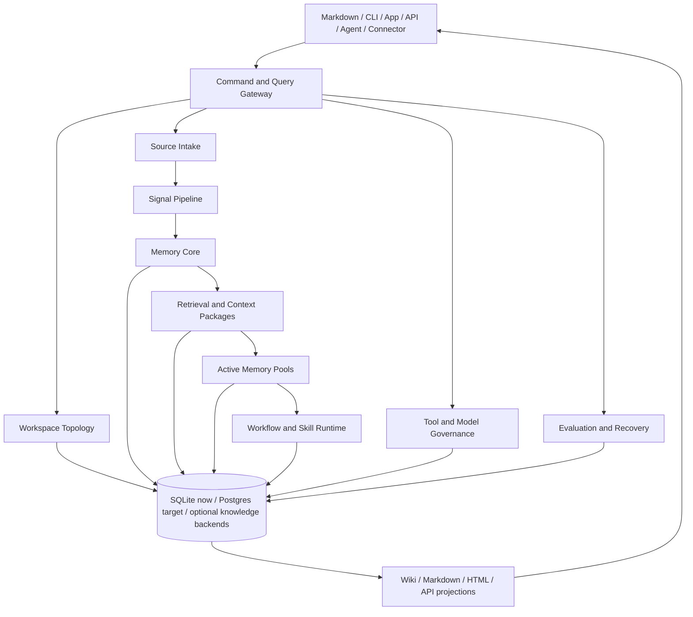
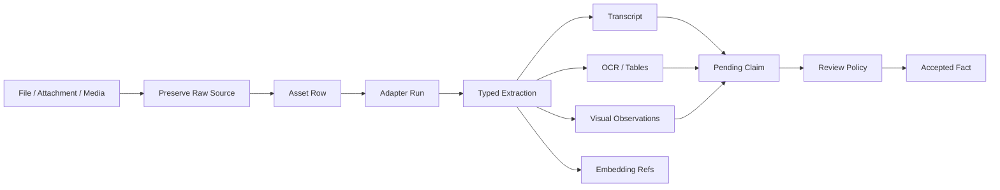

# Optimal Engine

[](https://github.com/Miosa-osa/OptimalEngine/actions/workflows/ci.yml)
[](LICENSE)
[](mix.exs)

Optimal Engine is a self-hosted second brain and operating engine for human and
AI workspaces.

It gives a person, team, or company a governed place to organize work, preserve
source evidence, build institutional memory, retrieve trusted context, operate
with agents, and project the same state into markdown, APIs, dashboards, CLI
tools, and workflows.

It is not only a notes app, a vector database, or an agent task runner. It is the
runtime underneath a workspace:

```text
Define the world    -> Organization, Workspaces, Nodes, relationships, policies
Capture evidence    -> Sources, files, messages, events, tool results
Build memory        -> Signals, Claims, Facts, Memory Objects
Use context         -> Retrieval, Context Packages, Active Memory Pools
Run work            -> Tools, models, workflows, Skill Packages
Project the state   -> Markdown, wiki pages, dashboards, exports, APIs
```

Signal classification is the front door for noisy input:

```text
Signal = Mode + Genre + Type + Format + Structure
```

The engine keeps those dimensions separate so it can route, parse, review,
package, and retrieve the input without pretending every file or message is the
same kind of thing.

See [`docs/concepts/signal-theory.md`](docs/concepts/signal-theory.md) for the
breakdown and anti-noise rules.

Most users should start by dumping messy context into the engine. The engine
preserves that input, proposes structure, asks follow-up questions, and waits for
review before turning suggestions into durable workspace truth.

For the full first-workspace story and copy-paste starter prompts, read
[`docs/guides/first-workspace-story.md`](docs/guides/first-workspace-story.md)
and [`templates/starter-prompts/`](templates/starter-prompts/).

## What You Can Build With It

Optimal Engine is designed for operating systems around real work:

| Use case | What the engine gives you |
| --- | --- |
| Company second brain | Source-backed memory for decisions, projects, people, customers, procedures, and institutional context. |
| Personal operating system | Workspaces for life, work, learning, people, money, projects, and daily rhythm. |
| Agent workspace | Governed Context Packages, Active Memory Pools, tool permissions, observations, and audit. |
| Research system | Source Packages, Claims, Facts, citations, relationships, retrieval, and evidence trails. |
| Product, operation, or initiative OS | Nodes for products, operations, initiatives, features, decisions, milestones, blockers, releases, and workflows. |
| Operations/SOP system | Workflow traces, validated procedures, Skill Packages, tool calls, and exception handling. |
| Customer/support memory | Customer nodes, issue history, prior fixes, current-valid Facts, and source-linked recall. |

## Core Model

The hierarchy is intentionally simple:

```text
Tenant / Organization
  -> Workspaces
      -> Nodes
          -> attached sources, signals, memory, wiki pages, workflows, skills
```

A Project is only one optional Node type inside a Workspace. It is not a peer
of Workspace, and the engine does not require every workspace to have projects.

```text
Workspace
  -> Entity / Company Node
  -> Team / Department Node
  -> Person Node
  -> Product Node
  -> Operational Node
  -> Project Node, when there is a bounded initiative
  -> Context Node
  -> Learning Node
```

Companies often have projects they are focused on, but those projects live in
the same Node graph as everything else. A company may also choose not to model
projects at all and instead organize around operations, products, customers,
departments, accounts, or rhythms.

Use a Project Node when the thing has a bounded initiative shape: a scope,
timeline, deliverables, blockers, milestones, and review cadence. Use another
Node type when the thing is ongoing or structurally different:

| User language | Usually model as |
| --- | --- |
| Platform Launch, SOC2 Push, Website Rebuild | Project Node |
| Customer Success, Hiring Pipeline, Content Publishing | Operational Node |
| Customer Portal, Internal Agent Runtime | Product Node |
| Example Customer, Partner Account | Entity/Customer Node |
| Weekly Review, Daily Focus | Operational/Rhythm Node |
| Research Library, Market Notes | Learning/Context Node |

Users can call project-like things initiatives, campaigns, engagements, deals,
cases, programs, or accounts. The engine preserves those labels as scoped
aliases while keeping the canonical object clean when `project` is the right
type:

```text
node_type: project
display_label: Initiative
display_name: Q3 Partner Launch
aliases: ["launch project", "partner launch", "q3 initiative"]
```

This matters because names are part of routing. Loose names resolve inside the
current organization/workspace scope. Ambiguous names produce a clarification
question instead of a silent durable write.

Layers are engine services that operate across the hierarchy:

```text
Workspace / Topology
Source Intake
Signal Pipeline
Memory Core
Retrieval / Context
Active Memory Pools
Workflow / Skill Runtime
Tool / Model Governance
Wiki / Export Surface
Evaluation / Audit / Recovery
```

## Operating Flow

```mermaid
flowchart LR
  Human[Human / Agent / App / Connector] --> Scope[Workspace + Node Scope]
  Scope --> Source[Source Package]
  Source --> Signal[Signal]
  Signal --> Route[Route to Node]
  Route --> Claim[Claim]
  Claim --> Review[Review / Policy]
  Review --> Fact[Fact]
  Fact --> Memory[Memory Object]
  Memory --> Recall[Retrieval]
  Recall --> Context[Context Package]
  Context --> Pool[Active Memory Pool]
  Pool --> Action[Human or Agent Action]
  Action --> Observation[Observation]
  Observation --> Claim
```



The same pattern works whether the input is a markdown edit, uploaded file,
calendar event, API payload, connector sync, tool result, or agent observation.

## Tiers, Layers, Stages, Rhythm

These concepts are still part of the engine.

### Tiers

```text
Tier 1: preserved sources and raw artifacts
Tier 2: rebuildable indexes, summaries, chunks, embeddings, projections
Tier 3: human-facing wiki/export pages and app views
```

Tier 3 is useful for humans and agents, but canonical truth lives in governed
engine objects with provenance and policy.

### Layers

```text
Topology owns the shape of the workspace.
Intake owns source preservation.
Signal owns classification.
Memory Core owns claims, facts, memories, edges, and ledger.
Retrieval owns context assembly.
Active Pools own task-local working state.
Workflow/Skill owns repeatable procedures.
Tool/Model Governance owns calls, permissions, validation, and audit.
Export owns markdown, HTML, reports, and app projections.
```

### Stages

```text
Setup workspace
  -> Create Nodes
  -> Ingest sources
  -> Classify Signals
  -> Extract Claims
  -> Promote Facts
  -> Build Memories
  -> Retrieve Context
  -> Work in Active Pools
  -> Capture Observations
  -> Promote Workflows and Skills
```

### Rhythm

Rhythm is the human operating cadence: daily focus, weekly review, node status,
open decisions, blockers, and follow-up loops. The engine treats rhythm as part
of the workspace, not as random notes.

```text
Daily work -> observations, updates, pending claims
Weekly review -> node state, priorities, decisions, stale context
Monthly review -> workspace health, workflow promotion, memory cleanup
```

## Retrieval Pipeline: Ordered Chain, Signal Branching, MCTS, Token Tiers

This is the brain part. Everything is classified in Signal Theory dimensions, and
those dimensions decide where the engine looks and how data is chained. The engine
does not treat every input the same; it branches.

### Signal-dimensional branching (the front door)

Every input and every query is a Signal `S = (Mode, Genre, Type, Format, Structure)`.
The dimensions choose the path:

```text
Mode      linguistic / visual / code / data / mixed   -> which parser + which index (FTS, vector, OCR, code-aware)
Genre     brief / spec / transcript / decision-log /  -> which skeleton (191 templates), which node kind,
          note / ... (143+ genres)                       which retention/decay rate
Type      direct / inform / commit / decide / express -> commit|decide -> Claim candidate (push toward Fact);
                                                          express|note -> low retention, stays at Signal
Format    markdown / pdf / audio / video / json       -> which extraction (parse, transcribe, OCR, visual)
Structure the genre skeleton                          -> how it is sectioned and summarized into L0/L1/L2 tiers
```

A `decision-log` transcript routes to the node's `decisions/`, becomes a Claim, and
is promoted toward a Fact. A casual `note` decays in days and never leaves the Signal
layer. Same engine, different branch, chosen by the signal's dimensions.

### The retrieval chain (strict order, cheapest first)

A query is itself a Signal: it is classified, then resolved through an ordered chain.

```text
1. CLASSIFY query   -> S=(M,G,T,F,W) + workspace/node scope + token budget
2. CANDIDATE GEN    -> run the stores in parallel, each returns a ranked list:
                       a. FTS5 / BM25        (lexical)
                       b. Vector / semantic   (embeddings)
                       c. Knowledge graph     (1..n-hop edge traversal)
                       d. Temporal / recency  (decay-weighted)
3. FUSE             -> Reciprocal Rank Fusion (RRF) across the lists -> one ranked candidate set
4. DECAY / POLICY   -> temporal decay + S/N filter + governance/authorization gate
5. SELECT (MCTS)    -> budget-aware Monte Carlo Tree Search: choose the subset that
                       maximizes coverage/relevance WITHIN the token budget
                       (UCT selection, greedy rollout, reward = coverage, backprop).
                       Falls back to greedy when retrieval.mcts_enabled is off.
6. TIER ASSEMBLE    -> fill the budget by disclosure tier, cheapest first (below)
7. PACKAGE          -> an authorized Context Package (provenance + scope), not raw chunks
8. DELIVER          -> human terminal / agent context / app / Active Memory Pool
```

### Token tiers (disclosure ladder, cheapest first)

Retrieval starts at L0 and drills down only as budget and need require. This is the
token optimization: maximum meaning per token, never load L3 when L1 answers.

```text
L0  headline   ~10 words    ~2K budget    always-loaded inventory, dashboards
L1  summary    ~50 words     ~10K         warm context, search snippets
L2  detail     ~500 words    ~50K         agent working memory
L3  complete   verbatim      unbounded    audit, deep research
```

The bandwidth planner downgrades an item to a lower tier to fit the budget rather
than dropping it.

### The places it can look (one brain, many stores)

```text
sources (raw evidence) -> signals -> claims -> facts -> memory_objects
relationship_edges (graph) | FTS index | vector index | context_packages | active_memory_pools
```

Each store is a layer with a single owner. Retrieval fuses across them, MCTS chooses
under budget, tiers compress. That ordering is the chaining: classify, branch by
dimension, generate candidates across every store, fuse, score, select with MCTS,
assemble by tier, deliver.

The agent-facing storage catalog exposes 12 logical stores through
`GET /api/stores`: relational, full-text, vector, graph, assets, cache, jobs,
metrics, backups, decomposition, models, and secrets. These are logical
capabilities, not a requirement to deploy 12 separate database servers. The
default local runtime uses SQLite, FTS5, RocksDB, ETS, and filesystem artifacts.

## Product Surfaces

Optimal Engine is the backend runtime. Different surfaces can control or display
the same state.

| Surface | Role |
| --- | --- |
| Markdown workspace | Direct human/agent editing and portable workspace projection. |
| CLI | Fast local setup, inspection, retrieval, rendering, and verification. |
| API | App, dashboard, service, and automation integration. |
| MCP/tools | Agent-safe access to memory, retrieval, wiki, and workspace actions. |
| Wiki/export | Human-readable pages, reports, packages, and app views. |
| Database | Canonical runtime state, provenance, permissions, audit, and rebuildable projections. |

Markdown is not removed. Markdown becomes an inspectable control surface backed
by the database.

```text
Markdown edit -> Source Package or topology change -> reviewed engine state
Engine state  -> Markdown/wiki/API/dashboard projection
```

The recommended filesystem projection is:

```text
organization/
  organization.yaml
  workspaces/
    company-os/
      workspace.yaml
      AGENTS.md
      rhythm/
      nodes/
        project-platform-launch/
          node.yaml
          context.md
          signal.md
          sources/
          decisions/
          workflows/
          exports/
```

See [`docs/guides/workspace-filesystem.md`](docs/guides/workspace-filesystem.md)
for the full convention.

Packages are receiver/channel bundles, often zipped from multiple files. A
package for one project, customer, product, person, or operation belongs under
that Node:

```text
nodes/project-platform-launch/packages/partner-update/
  package.yaml
  dist/partner-update.zip
```

Workspace-level packages are only for bundles that intentionally span multiple
Nodes and declare those Nodes in a manifest.

See [`docs/guides/packages-and-exports.md`](docs/guides/packages-and-exports.md)
for package placement rules.

## Storage Vs Projection

The engine deliberately separates where data is stored from how it is organized
and displayed.

```text
Storage substrate   -> SQLite, Postgres, raw artifact storage, indexes, caches,
                       optional graph/knowledge backends.
Domain ownership    -> topology, intake, signal, memory, retrieval, active work,
                       workflow, skill, governance, evaluation.
Projection surface  -> markdown, wiki, HTML, app UI, API, MCP/tools, reports,
                       agent context packages.
```

### Thin to wide (narrow canonical core, wide derived fan)

A few THIN canonical truths fan out into many WIDE derived stores and projections.
You write narrow and read wide:

```text
THIN canonical core (governed truth, few rows, NOT rebuildable)
  workspaces -> nodes -> facts -> memory_objects -> decisions
        |
        v   derive / index / project
WIDE derived fan (many stores, rebuildable from core + sources)
  signals | claims | contexts | chunks | chunk_embeddings | vectors |
  relationship_edges | FTS index | context_packages | active_memory_pools |
  wiki_pages | exports | dashboards | API responses
```

Retrieval runs the same shape in time: a THIN query fans WIDE across every store
(parallel candidate generation), then narrows back THIN via RRF + MCTS into a
tiered Context Package. The motion is always thin -> wide -> thin.

The database stores governed runtime state. Markdown, wiki pages, app views,
HTML, reports, and agent prompts are projections or control surfaces. If a human
edits a projection, that edit re-enters the engine as source evidence or a
reviewed topology change instead of silently overwriting truth.

See [`docs/architecture/STORAGE-AND-PROJECTION-MAP.md`](docs/architecture/STORAGE-AND-PROJECTION-MAP.md)
for the full map.

See [`docs/architecture/STORAGE-CAPABILITIES-AND-WORKSPACE-FLOW.md`](docs/architecture/STORAGE-CAPABILITIES-AND-WORKSPACE-FLOW.md)
for the local-first capability ladder, workspace policy, optional provider activation, module flow, and Fractal enterprise boundary.

### Retrieval and long-document decomposition

Hybrid retrieval combines FTS candidates, workspace-scoped context vectors,
and per-chunk semantic reranking. Chunk embeddings remain rebuildable
projections and never become accepted facts.

The deterministic four-level decomposer remains the default ingestion path.
An optional local DSPy RLM sidecar can recursively inspect unusually large or
structurally difficult sources through Deno/Pyodide. RLM output enters the same
governed Source Package, Signal, Claim, Fact, and Memory lifecycle and falls
back safely when the local model runtime is unavailable.

### Storage verification

Use the catalog for inventory and the deep audit for proof:

```bash
curl http://localhost:4200/api/stores
curl http://localhost:4200/api/stores/audit
curl http://localhost:4200/api/storage/providers?probe=true
curl http://localhost:4200/api/storage/use-cases
```

The deep audit verifies SQLite integrity, foreign keys, migration parity, FTS
parity, workspace isolation, vector shape and references, leaked fixtures,
asset paths, a verified backup, DSPy/Deno health, and ETS cache availability.
It returns HTTP 503 when any invariant fails.

For scope switching rules across organization, workspace, Node, and task pool,
read [`docs/guides/scope-switching.md`](docs/guides/scope-switching.md).

For installation profiles, local vs enterprise storage, Docker, multimodality,
and adapter setup, read
[`docs/guides/installation-and-deployment.md`](docs/guides/installation-and-deployment.md).

For canonical naming, aliases, and how the engine handles user-specific labels,
read [`docs/guides/naming-and-aliases.md`](docs/guides/naming-and-aliases.md).

For common communication channels, imports from old systems, connector types,
and recurring package types such as proposals, contracts, SOPs, and client
requirements, read
[`docs/guides/integrations-and-imports.md`](docs/guides/integrations-and-imports.md).

For building custom apps, dashboards, client portals, static pages, public
links, package delivery flows, or deployment surfaces on top of the engine, read
[`docs/guides/interfaces-and-publishing.md`](docs/guides/interfaces-and-publishing.md).

For when to use CLI tools, MCP servers, A2A agents, APIs, connector syncs,
scripts, and scheduled jobs, read
[`docs/guides/tool-surfaces-and-loops.md`](docs/guides/tool-surfaces-and-loops.md).

For repeatable goal loops with checklists, validation gates, stop conditions,
and memory/audit outputs, read
[`docs/guides/agentic-loops.md`](docs/guides/agentic-loops.md).

The short version for users bringing their own agents:

```text
Define loop goal
  -> choose workspace and owning Node
  -> retrieve Context Package
  -> run agent through allowed CLI/MCP/API/script/scheduler/A2A surfaces
  -> validate each phase
  -> record observations and pending Claims
  -> promote repeated validated work into workflows or Skill Packages
```

Loop definitions should live near the Node they operate on, for example:

```text
nodes/operation-weekly-review/loops/weekly-review.loop.yaml
nodes/product-customer-portal/loops/release-maintenance.loop.yaml
```

For the concrete backend readiness status, store ownership, verification
commands, and remaining hardening work, read
[`docs/reference/backend-readiness.md`](docs/reference/backend-readiness.md).

For the recommended documentation path, start at
[`docs/README.md`](docs/README.md).

For the backend-first build plan, layer guide, and diagrams showing what each
part is used for, read [`docs/ROADMAP.md`](docs/ROADMAP.md).

## Repository Layout

The top-level folders are product surfaces, not random piles of code:

| Path | Purpose |
| --- | --- |
| `lib/` | Elixir/OTP runtime: topology, intake, memory, retrieval, API, wiki/export, governance, evaluation. |
| `test/` | Runtime, API, topology, wiki, memory, connector, and evaluation tests. |
| `apps/` | App surfaces such as docs and MCP server packages. |
| `desktop/` | Desktop/app shell surface. |
| `extensions/` | Browser and Raycast integration surfaces. |
| `sdks/` | TypeScript, Python, and UI/client SDKs. |
| `site/` | Public site surface. |
| `skills/` | Agent skill package for using the engine from coding assistants. |
| `sample-workspace/` | Example workspace convention for new users. |
| `deploy/` | Docker/production deployment assets. |
| `docs/` | Reference docs for concepts, architecture, data model, operations, and build alignment. |

Generated dependency folders, local databases, build outputs, and generated
binaries are intentionally ignored. They should be rebuilt locally, not tracked.

## First-Run Initiation

The first real workflow is not a perfect form. It is a data dump.

```text
User dumps messy context
  -> engine preserves the dump as a Source Package
  -> engine extracts an unreviewed setup Claim
  -> engine detects conservative Nodes and integration surfaces
  -> detected Nodes become workspace topology by default
  -> integration/tool surfaces stay disabled until scoped
  -> future sources route into the approved topology
```

Run it with a markdown or text file:

```bash
mix optimal.initiate my-workspace --name "My Workspace" --dump setup.md
```

The initiation command is conservative by design. It only applies explicit,
high-confidence structure from headings, labels, and lists. It does not promote
the setup dump into Facts. Use `--review-only` when a workspace needs every
topology change to stay pending until a human or policy reviewer approves it.

It also inventories outside systems mentioned in the dump:

```text
MCP servers
connector syncs
custom APIs
scripts and cron jobs
model/tool calls
local files and markdown folders
third-party systems such as calendar, mail, calls, tickets, repos, CRM, docs
```

Those become disabled governed tool definitions until the user confirms
credentials, scopes, allowed Nodes/partitions, read/write policy, and which
actions require confirmation.

## Architecture



The physical database can be shared. Ownership is not shared. Each table group
has an owning layer and a lifecycle.

| Table group | Owner |
| --- | --- |
| `workspaces`, `nodes`, `node_types`, `node_relationships`, `node_members` | Workspace / Topology |
| `source_packages`, `claims`, `facts`, `memory_objects`, `relationship_edges`, `derivation_ledger` | Memory Core |
| `assets`, `asset_adapter_runs`, `asset_extractions`, transcript/OCR/visual projection rows | Memory Core / Pipeline |
| `contexts`, FTS/search projections, signal metadata | Signal/Search compatibility |
| `context_packages`, retrieval plans, retrieval audit | Retrieval / Context |
| `active_memory_pools`, observations, loaded context links | Active Work |
| `workflow_traces`, `generalized_workflows`, `procedural_memory_objects`, `skill_packages` | Workflow / Skill Runtime |
| `model_call_operations`, `mcp_tool_definitions`, call runs | Tool / Model Governance |
| `wiki_pages`, `export_records`, `projection_revisions`, `link_health_records` | Wiki / Export |
| `evaluation_runs`, `evaluation_cases` | Evaluation |

## Memory Lifecycle

Optimal Engine separates what was said from what is accepted as true.

```text
Source Package
  -> Signal
  -> Claim
  -> Fact
  -> Memory Object
  -> Context Package
  -> Active Memory Pool
  -> Observation
  -> Pending Claim
```

This prevents an agent, parser, connector, or markdown edit from silently
becoming truth.

Facts and Memory Objects can carry:

```text
source links
evidence links
confidence
precision
valid time
transaction time
security labels
partition scope
review state
supersession state
derivation ledger links
```

## Multimodal Evidence

Text is not the only source. Files and media enter the same governed lifecycle.



Supported input families include:

```text
text
documents
code
images
audio
video
calendar/events
messages/conversations
tickets/tasks
database/API payloads
tool results
workspace projection edits
```

The current open-source adapter registry is in:

```text
lib/optimal_engine/pipeline/multimodal_tool_registry.ex
docs/reference/multimodal-open-source-stack.md
```

Deployments choose which heavier local tools to install. Missing adapters should
degrade gracefully: raw evidence is still preserved, and unavailable runs are
recorded instead of being hidden.

## Quick Start

Requirements:

- Elixir `~> 1.17`
- Erlang/OTP 26+
- Node 20+ for app/site surfaces
- A local C toolchain for optional native dependencies
- Snappy for the RocksDB knowledge graph backend

Run the engine locally:

```bash
brew install snappy
make install
make bootstrap
make dev
```

`make dev` starts the HTTP engine on `http://localhost:4200`.
It creates a local connector key in `.optimal/connector_key` when one is not already set.
The `.optimal/` directory is local runtime state and is ignored by git, so your database, workspace runtime files, cache, WAL files, and keys do not go into the repo.

In another terminal, verify the running engine:

```bash
curl http://localhost:4200/api/health
mix optimal.reality_check
```

Use the checked-in `bin/optimal` command wrapper:

```bash
bin/optimal --help
bin/optimal doctor
bin/optimal boot
bin/optimal reality-check
```

That wrapper is for source checkouts.
It delegates to `mix optimal.*` so native database dependencies load correctly.
For production/API deployment, use the OTP release or container shape instead of treating the checkout wrapper as the server binary.

There are three CLI surfaces:

- `bin/optimal` is the source-checkout command for humans, local agents, scripts, and fresh clones.
- `lib/optimal_engine/cli.ex` is the packaged CLI router for a compiled `optimal` command.
- `mix optimal.*` tasks are the native development surface where the implementation lives.

The preferred public command surface is `bin/optimal`.
It keeps a stable command name while still routing through the same engine tasks, stores, and policies as the native Mix layer.

Create a markdown-operable workspace:

```bash
bin/optimal initiate my-workspace --name "My Workspace" --dump setup.md
bin/optimal setup my-workspace --name "My Workspace"
bin/optimal topology --workspace default:my-workspace
```

Use `optimal.initiate` when starting from a messy dump. Use `optimal.setup` when
you already know the workspace and starter Nodes you want.

Local CLI commands are trusted local commands against the configured store. For
apps, MCP servers, remote agents, or scripts that connect over HTTP/API, mint a
scoped API key:

```bash
bin/optimal auth mint --name "Business OS" --workspace default:my-workspace
bin/optimal auth env --name "Local Agent" --workspace default:my-workspace
```

Render wiki/export projections:

```bash
mix optimal.wiki render-node first-project --workspace default:my-workspace
mix optimal.wiki render-tree --workspace default:my-workspace
mix optimal.wiki check node-first-project --workspace default:my-workspace
```

Ask the engine:

```bash
bin/optimal find "project" --workspace default:my-workspace
bin/optimal rag "what changed this week?" --workspace default:my-workspace
```

Run the agent memory loop:

```bash
bin/optimal boot
bin/optimal find "pricing decision" --workspace default:my-workspace
bin/optimal capture "Raw meeting note or source text" --workspace default:my-workspace
bin/optimal aware "Important correction or decision" --workspace default:my-workspace
bin/optimal note "Small thing to remember" --workspace default:my-workspace
bin/optimal lesson "Reusable lesson for future work" --workspace default:my-workspace
bin/optimal decision "Decision made and why" --workspace default:my-workspace
bin/optimal task "Follow-up action item" --workspace default:my-workspace
bin/optimal close "What changed, what was verified, and what remains" --workspace default:my-workspace
```

Review the truth layer:

```bash
bin/optimal claims --workspace default:my-workspace
bin/optimal claims get <claim-id> --workspace default:my-workspace
bin/optimal claims promote <claim-id> --workspace default:my-workspace --actor user:reviewer
bin/optimal claims reject <claim-id> --workspace default:my-workspace --actor user:reviewer
bin/optimal facts --workspace default:my-workspace
bin/optimal facts get <fact-id> --workspace default:my-workspace
```

Claims are pending truth.
Facts are accepted truth.
Agents can capture evidence and propose Claims, but review or policy should decide which Claims become Facts.

### Custom Commands

Teams can add custom commands for their own data, organization, workspaces, Nodes, and context flows.
The recommended pattern is to add a focused `Mix.Tasks.Optimal.<Name>` module, expose it through `OptimalEngine.CLI`, and add a small `bin/optimal` wrapper only when the command needs source-checkout ergonomics.

Custom commands should take explicit scope.
Use workspace ids such as `default:my-workspace`, Node ids, source ids, claim ids, or fact ids rather than implicit global state.

Good custom commands usually do one of these jobs:

- Find context from a workspace, Node, source package, claim, fact, or memory pool.
- Capture a new signal and preserve the raw source.
- Assemble a governed Context Package for an agent or workflow.
- Promote, reject, supersede, or inspect truth lifecycle records.
- Render a projection such as markdown, wiki, HTML, API output, or a BusinessOS view.
- Run a registered connector, script, model, or tool through the governance layer.

Custom commands should not write final truth directly into markdown, app tables, or ad hoc files.
They should route through Source Packages, Claims, Facts, Memory Objects, Relationship Edges, and the Derivation Ledger so the engine can explain where knowledge came from.

### How Apps And Agents Use The Engine

Optimal Engine is used as the memory and context service behind an app, agent, or workflow.
The app keeps its own product state, and the engine keeps source-linked knowledge, retrieval, Claims, Facts, Memory Objects, graph relationships, and Context Packages.

There are four normal integration paths:

- Local humans and local coding agents use `bin/optimal`.
- Packaged runtimes can expose the compiled `optimal` command through `lib/optimal_engine/cli.ex`.
- Apps and remote agents call the HTTP API with a scoped key minted by `bin/optimal auth mint`.
- BusinessOS configures an engine endpoint and workspace mapping, then reads and writes knowledge through that configured engine instead of storing long-term memory in BusinessOS tables.

Every integration should pass tenant, organization, workspace, and Node scope when that scope matters.
That is how multiple businesses, teams, and workspaces can share one engine runtime without mixing data.

For example, BusinessOS should store desktop windows, installed apps, module settings, and user preferences in BusinessOS.
When a user or agent creates a lasting insight, source note, decision, task, lesson, or context package, BusinessOS should mirror that signal into the configured Optimal Engine workspace.

The correct claim is not "Optimal Engine magically remembers everything."
The correct claim is "Optimal Engine provides the scoped memory, context, truth, and retrieval layer, and products must explicitly write useful signals into it."

## Agent SOP

A coding agent or assistant should use the engine in this order:

```text
1. Inspect workspace topology.
2. Retrieve a governed Context Package.
3. Work inside the current task scope.
4. Use registered tools or APIs.
5. Record observations.
6. Promote useful observations to pending Claims.
7. Let review/policy promote Claims into Facts.
8. Export markdown/wiki/app views from engine state.
```

Agents should not bypass Memory Core by writing final truth directly into
markdown or raw tables.

Agents should also not call arbitrary outside systems directly. Whether the
surface is MCP, a connector, an API, or a script, it should be registered,
permissioned, schema-checked, executed, logged, and converted back into Source
Packages or observations when it produces useful evidence.

Agent-facing docs are included in the repo:

- `AGENTS.md` is the full agent contract.
- `CLAUDE.md` is the Claude Code boot contract.
- `BOOT.md` is the day-start and session-start protocol.
- `SYSTEM.md` explains the engine layers and operating model.
- `OPTIONS.md` records choices, tradeoffs, and configurable operating modes.
- `RESOURCES.md` points agents to the right commands, files, and docs.

These files are public operating instructions.
They must describe how to use the engine without embedding private stores, user memories, workspace dumps, connector keys, or credentials.

## Docker And Deployment

Docker is optional.

Use local Elixir/SQLite for development and personal use:

```text
.optimal/index.db
```

That file is the local canonical runtime store.
It is not committed to git.
Clone users get the engine code and setup scripts, then create their own local store when they run the engine.

Use Docker or a managed runtime when you want a packaged service stack:

```bash
docker compose -f deploy/docker-compose.yml up
```

The target production database is Postgres. The architecture is built so the
physical store can change while layer ownership stays the same.

```text
SQLite now: local canonical runtime store
Postgres target: production canonical runtime store
FTS/vector/index/cache rows: rebuildable projections
ETS/RocksDB/Mnesia/Riak knowledge backends: optional graph/triple-store engines
Markdown/files/wiki/HTML/API: export and control surfaces
```

RocksDB is not the main workspace database today. It is an optional persistent
knowledge backend for graph/triple-store workloads when the runtime has the
required native RocksDB library available.

## Verification

Core reality check:

```bash
mix optimal.reality_check
```

Current verified result:

```text
126 probes, 126 ok, 0 warn, 0 fail
```

Focused topology/wiki path:

```bash
mix test test/wiki/service_test.exs \
  test/wiki/store_test.exs \
  test/workspace_export_test.exs \
  test/mix_tasks/optimal_setup_test.exs \
  test/workspace_initiation_test.exs \
  test/mix_tasks/optimal_initiate_test.exs \
  --seed 0
```

Current result:

```text
19 tests, 0 failures
```

Focused multimodal/memory path:

```bash
mix test test/memory_core/spine_test.exs \
  test/pipeline/multimodal_adapter_runner_test.exs \
  test/memory_core/asset_store_test.exs \
  --seed 0
```

## What Is Built

The runtime already includes:

- Workspace topology with Workspaces, Nodes, Node Types, relationships,
  membership, setup CLI, and filesystem projections.
- First-run workspace initiation from messy context dumps, with preserved source
  evidence, pending setup Claims, proposed Nodes, open questions, and disabled
  integration placeholders.
- Source Package preservation for raw text and governed assets.
- Signal classification and compatibility search rows.
- Claim, Fact, Memory Object, Relationship Edge, and Derivation Ledger tables.
- Claim review and Fact inspection from the CLI.
- Fact promotion, stale/conflict handling, supersession, and context invalidation.
- Context Packages with permission-aware package assembly.
- Active Memory Pools with load, refresh, observe, and close flows.
- Multimodal asset preservation, adapter run records, typed extraction
  projections, and derived pending Claims.
- Tool/model governance run records and permission checks.
- Connector and integration governance for MCP, connector, API, and script
  surfaces before agents can use outside systems.
- Wiki/export rendering for Node pages and workspace tree pages.
- Evaluation run/case records and JSON/JSONL dataset execution.
- Public agent boot docs for `AGENTS.md`, `CLAUDE.md`, `BOOT.md`, `SYSTEM.md`, `OPTIONS.md`, `RESOURCES.md`, and `NOTES.md`.
- BusinessOS integration boundaries so app state stays in BusinessOS while knowledge, context, RAG, Claims, Facts, and memory stay in the configured Optimal Engine.
- Reality check probes across the major runtime paths.

## Roadmap

The backend-first roadmap is organized as build gates:

```text
Workspace Topology
  -> Source-First Intake
  -> Signal and Multimodal Processing
  -> Claim, Fact, and Memory Review
  -> Retrieval and Context Packages
  -> Agent Runtime and Tool Governance
  -> Workflow and Skill Lifecycle
  -> Projection and Business OS Integration
  -> Evaluation, Recovery, and Production Hardening
```

Read the full roadmap, diagrams, layer guide, and "what each part is used for"
here:

[`docs/ROADMAP.md`](docs/ROADMAP.md)

## Development Rule

Do not make `Store` the owner of business meaning.

Good:

```text
WorkspaceTopology.create_node(...)
MemoryCore.extract_claim(...)
MemoryCore.promote_claim_to_fact(...)
MemoryCore.retrieve(...)
MemoryCore.open_active_pool(...)
WorkspaceExport.project(...)
```

Avoid:

```text
Store.create_fact(...)
Store.publish_observation(...)
Context.make_truth(...)
raw SQL from feature modules into governed tables
```

`Store` can execute database writes. Domain layers own lifecycle decisions.

## License

Optimal Engine is released under the [MIT License](LICENSE).
