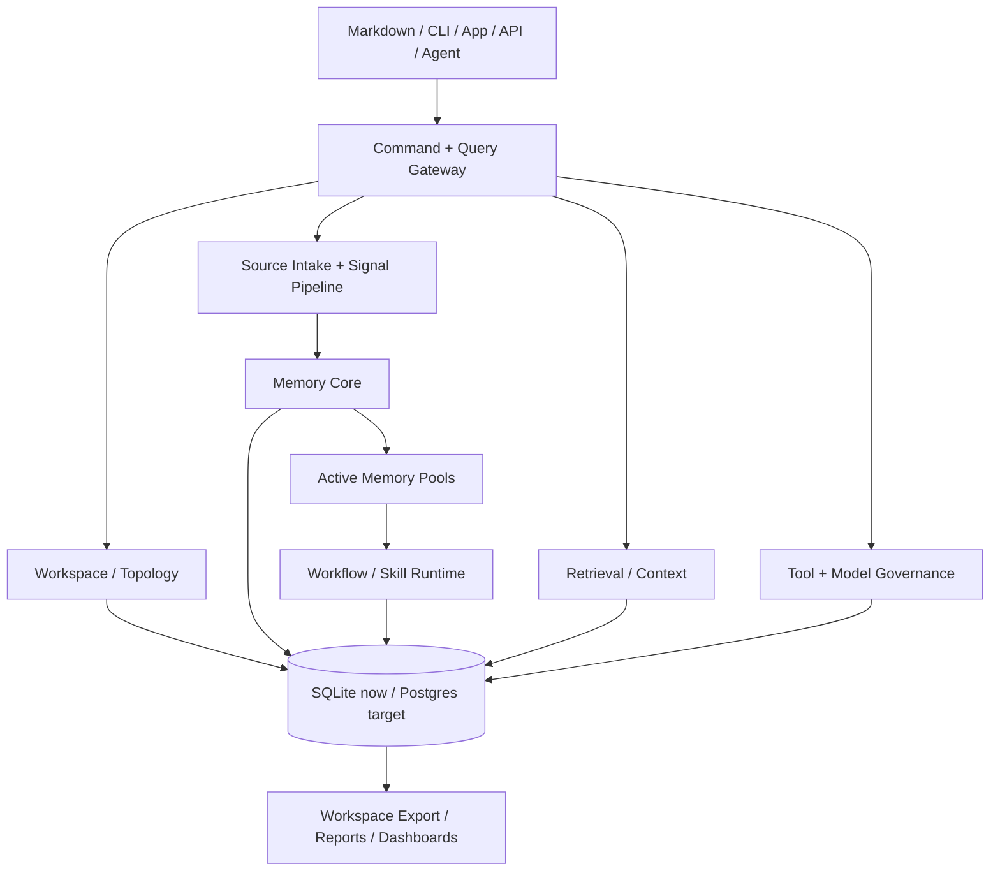
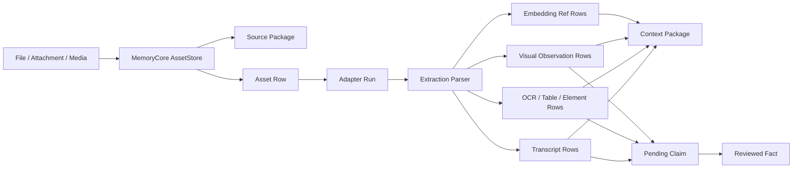

# Optimal Engine

Optimal Engine is a self-hosted operating engine for human and AI workspaces.

It lets a person or organization define a workspace, organize that workspace into
typed Nodes, preserve source evidence, classify incoming Signals, promote
reviewed knowledge into Facts and Memory Objects, assemble governed context for
humans and agents, and project the same state into markdown, APIs, dashboards,
CLI tools, and agent runtimes.

The short version:

```text
Human defines the world:
  Workspace -> Nodes -> Relationships -> Policies

Data enters the world:
  Source Package -> Signal -> Route -> Claim -> Fact -> Memory Object

Humans and agents use the world:
  Query or task -> Context Package -> Active Memory Pool -> Action

Work improves the world:
  Observation -> Pending Claim -> Reviewed Fact -> Memory -> Workflow -> Skill
```

System flow:


## Current Build

The current build moves the engine from a file/search-first system toward a governed
workspace runtime.

Built and verified now:

| Area | Status |
| --- | --- |
| Workspace topology | Workspaces, Projects-as-Nodes, typed Nodes, Node Types, Node relationships, membership, and projection records. |
| Source evidence | Raw text becomes Source Packages with hash, workspace scope, trust label, security labels, partitions, and metadata. |
| Governed assets | Raw multimodal files can be preserved as Source Packages, workspace-scoped asset rows, and derivation ledger entries. |
| Pipeline asset governance | `Pipeline.run/2` preserves parser-produced assets through Memory Core before enrichment, decomposition, and embedding. |
| Indexer asset governance | Binary indexing can pass workspace scope into the governed pipeline so indexed assets do not fall back to the default workspace. |
| API asset uploads | `POST /api/assets` preserves JSON-uploaded or local-path files through Memory Core and can optionally run a governed multimodal adapter. |
| Connector asset ingestion | `Connectors.preserve_payload_assets/4` preserves connector attachments/files through Memory Core with connector origin metadata and per-attachment errors. |
| Connector sync asset preservation | Connector sync may return raw payloads with attachments/files; the runner preserves them through Memory Core before completing the run. |
| Multimodal tool registry | Open-source adapter targets are cataloged for document intelligence, OCR, audio, video, visual reasoning, visual document retrieval, and cross-modal embeddings. |
| Multimodal adapter runs | Adapter attempts and outputs can be recorded as governed derived artifacts linked to assets, Source Packages, scopes, hashes, and derivation ledger entries. |
| Multimodal adapter runner | Configured local adapter commands can execute against governed assets, with completed, failed, and unavailable runs recorded through Memory Core. |
| Structured multimodal extraction parsing | Nested transcript segments, document pages/elements/tables, and video frame observations/detections can be normalized into typed extraction projection rows. |
| Adapter-output Claims | Completed adapter outputs can be preserved as derived Source Packages and converted into pending Claims. Failed or unavailable adapter runs cannot become Claims. |
| Asset extraction projections | Completed adapter runs can be normalized into `asset_extractions` plus typed transcript, OCR span, visual observation, and embedding-ref projection tables. The adapter runner now auto-projects supported completed runs, and text-bearing extractions can become derived Source Packages and pending Claims. |
| Claim/Fact separation | Extracted text becomes an unreviewed Claim first. A Claim becomes a Fact only through the truth-promotion lifecycle. |
| Memory Objects | Accepted Facts can be wrapped into source-backed Memory Objects with evidence links and confidence/precision metadata. |
| Derivation Ledger | Source-to-Claim, Claim-to-Fact, and Fact-to-Memory steps write lineage entries. |
| Governed retrieval | Retrieval returns Context Packages, not loose chunks, and filters Facts, Memory Objects, and asset extraction projections by partition/security scope before package assembly. |
| Active Memory Pools | Task-scoped working memory can load Context Packages and publish observations as pending Claims. |
| Tool/model governance | Registered tools and model operations can enforce privileges, partitions, required inputs, required outputs, audit links, and the first governed execution path. |
| Connector governance | Connector sync can run through the governed tool-call surface, blocking unauthorized runs before connector execution and recording both connector-run and tool-call audit rows when allowed. |
| Workspace export | Markdown/files are projections and editing surfaces, not the only source of truth. |
| Reality check | `mix optimal.reality_check` covers store counts, topology, evidence/truth lifecycle, recall packages, retrieval, connectors, wiki, and compliance probes. |

Current verification:

```text
mix test test/memory_core/spine_test.exs test/workspace_export_test.exs test/topology/workspace_topology_test.exs test/topology/node_member_test.exs test/topology/node_test.exs test/topology/workspace_surface_spine_test.exs test/signal/dispatcher_test.exs test/connectors/runner_test.exs --seed 0
64 tests, 0 failures

mix test test/memory_core/asset_store_test.exs test/pipeline/pipeline_asset_store_test.exs test/pipeline/indexer_asset_store_test.exs --seed 0
5 tests, 0 failures

mix test test/pipeline/multimodal_tool_registry_test.exs test/memory_core/asset_store_test.exs test/pipeline/pipeline_asset_store_test.exs test/pipeline/indexer_asset_store_test.exs --seed 0
10 tests, 0 failures

mix test test/pipeline/multimodal_adapter_runner_test.exs test/pipeline/multimodal_tool_registry_test.exs test/memory_core/asset_store_test.exs test/pipeline/pipeline_asset_store_test.exs test/pipeline/indexer_asset_store_test.exs --seed 0
21 tests, 0 failures

mix test test/memory_core/spine_test.exs test/pipeline/multimodal_adapter_runner_test.exs test/memory_core/asset_store_test.exs --seed 0
28 tests, 0 failures

mix test test/api/router_test.exs --seed 0
27 tests, 0 failures

mix test test/connectors/asset_ingest_test.exs --seed 0
3 tests, 0 failures

mix test test/connectors/runner_test.exs test/connectors/asset_ingest_test.exs --seed 0
13 tests, 0 failures

mix test test/pipeline/multimodal_adapter_runner_test.exs --seed 0
8 tests, 0 failures

mix optimal.reality_check
116 probes, 116 ok, 0 warn, 0 fail
```

The full legacy suite still contains older optional/backend warnings. The focused
slice above is the current verified build path.

For the detailed build audit, see
[`docs/reference/build-goal-alignment.md`](docs/reference/build-goal-alignment.md).
It maps each intended layer to the code, tests, and remaining gaps.

## Product Shape

Optimal Engine has two sides that share the same state.

The human-operable side:

```text
Markdown workspace
CLI
App UI
Dashboards
Reports
Exports
```

The governed runtime side:

```text
SQLite/Postgres store
Workspace topology
Memory Core
Retrieval and Context Packages
Active Memory Pools
Workflow and Skill records
Model/tool governance
Audit and derivation records
```

Markdown stays important because it is portable, inspectable, and easy for humans
and coding agents to edit. The database becomes the canonical runtime for identity,
permissions, provenance, retrieval, audit, workflow state, and rebuildable
projections.

Runtime layer map:



## Core Architecture

Optimal Engine is organized by lifecycle ownership, not just where bytes are
stored.

```text
Workspace / Topology
  owns workspaces, nodes, node types, relationships, membership, policies

Signal Pipeline
  owns classification, quality, routing hints, compatibility context rows

Memory Core
  owns source packages, claims, facts, memory objects, edges, derivation ledger

Retrieval / Context
  owns recall planning, context packages, authorization envelope, retrieval audit

Active Collaboration
  owns active memory pools, task observations, pending claims, refresh state

Workflow / Skill Runtime
  owns traces, generalized workflows, procedures, skill packages, execution records

Model / Tool Governance
  owns model calls, tool definitions, governed execution, schema validation, permissions, audit

Workspace Export
  owns markdown, HTML, app views, report packages, projection records
```

One physical database can hold many layer-owned tables. The rule is that each
table has an owning layer, and other layers write through that owner instead of
directly inventing lifecycle state.

## Node Model

A Node is not a folder. A folder can be an export of a Node, but the Node itself
is a governed topology object.

A Node represents:

- a bounded context with a clear purpose;
- a place where sources, signals, decisions, people, projects, workflows, and
  memories can attach;
- a point in a larger workspace graph;
- a unit that can be reviewed, measured, routed to, and evolved.

Common Node types include:

```text
entity
department
team
project
operational
learning
person
product
partnership
context
```

Projects live inside a workspace as `project` Nodes. They are not a peer of the
workspace. The hierarchy is:

```text
Tenant
  -> Workspace
    -> Nodes
      -> Project Node
      -> Person Node
      -> Product Node
      -> Operational Node
      -> Context Node
```

## Data Lifecycle

The backend flow is intentionally conservative:

```text
Raw input
  -> Source Package
  -> Signal
  -> Route to Workspace / Node
  -> Compatibility Context row
  -> Claim
  -> Fact
  -> Memory Object
  -> Relationship Edge
  -> Context Package
  -> Active Memory Pool
  -> Observation / Pending Claim
  -> Workflow Trace
  -> Skill Package
```

Not every source goes through every step. Some inputs stop at Signal. Some Claims
never become Facts. Some Memory Objects never become workflows. That is expected.
The important thing is that each promotion step has evidence, ownership, and audit.

Multimodal evidence path:



## Storage Model

Local development uses SQLite at:

```text
.optimal/index.db
```

Docker is optional. You do not need Docker to run the local engine. Use Docker when
you want a packaged service stack or deployment-style environment.

Target production storage can move to Postgres while keeping the same layer
ownership model:

```text
SQLite now
Postgres target
Indexes and caches attached as rebuildable projections
Markdown/files exported from governed state
```

Table ownership:

| Table group | Owner |
| --- | --- |
| `workspaces`, `nodes`, `node_types`, `node_relationships`, `node_members` | Workspace / Topology |
| `contexts`, search projections, signal metadata | Signal/Search compatibility |
| `assets`, `asset_adapter_runs`, chunk asset refs, parser asset paths | Memory Core / Pipeline projections |
| `source_packages`, `claims`, `facts`, `memory_objects`, `relationship_edges`, `derivation_ledger` | Memory Core |
| `context_packages`, retrieval audit | Retrieval / Context |
| `active_memory_pools`, pool observations | Active Collaboration |
| `workflow_traces`, `generalized_workflows`, `procedural_memory_objects`, `skill_packages` | Workflow / Skill Runtime |
| `model_call_operations`, tool definitions, call runs | Model / Tool Governance |
| `export_records`, projection revisions, generated files | Workspace Export |

## Multimodality

The engine keeps a modality-aware data architecture. Text is still the most
complete truth-promotion path, but raw multimodal evidence now has a governed
storage path. Parser-produced assets can be copied into workspace asset storage,
linked to Source Packages, written into `assets`, and referenced by downstream
chunks through stable content hashes.

Canonical input families:

```text
text
document
code
image
audio
video
calendar/event
message/conversation
ticket/task
database/API payload
tool result
workspace projection edit
```

Each input type should still enter through the same evidence lifecycle:

```text
external source or local edit
  -> Source Package
  -> Signal classification
  -> Memory Core / Retrieval / Workflow as appropriate
```

For file-backed multimodal inputs, the current pipeline path is:

```text
file
  -> Parser asset
  -> MemoryCore.AssetStore
  -> Source Package + asset row + derivation ledger
  -> optional adapter run records for OCR/transcripts/visual outputs
  -> optional configured adapter command execution
  -> automatic asset_extractions + typed transcript/OCR/visual/embedding projection rows for supported completed runs
  -> text-bearing extraction can become derived Source Package + pending Claim
  -> governed ParsedDoc
  -> Decomposer chunk with asset_ref
  -> Embedder asset_paths lookup
```

Open-source adapter targets are tracked in:

```text
lib/optimal_engine/pipeline/multimodal_tool_registry.ex
docs/reference/multimodal-open-source-stack.md
```

The current recommended stack is:

| Modality | Primary open-source targets |
| --- | --- |
| Documents | Docling, Marker, olmOCR, Unstructured, Tesseract, ColPali/ColQwen |
| Images | Docling, Qwen VL, Tesseract, OpenCLIP, ImageBind |
| Audio | Docling, whisper.cpp, Whisper, ImageBind |
| Video | FFmpeg, Qwen VL, whisper.cpp, Whisper, ImageBind |

The registry is a capability contract. It does not imply every heavyweight model
is installed by default; deployments choose which local adapters to install, and
missing tools must degrade gracefully while raw evidence is still preserved.
When an adapter does run, `asset_adapter_runs` records the adapter, role,
modality, status, input hash, output hash, output text/reference, model metadata,
security scope, partitions, and derivation ledger link.
`MemoryCore.run_asset_adapter/3` is the current runtime bridge: it loads a
governed asset, resolves a registry adapter, executes a configured local command
when present, and records completed, failed, or unavailable status.
For supported completed runs, it also auto-projects output into the typed
extraction tables unless `auto_extract: false` is passed. Document/OCR adapters
default to OCR-span projections, audio transcription adapters default to
transcript projections, visual reasoning adapters default to visual observation
projections, and multimodal embedding adapters default to embedding-ref
projections when a reference is available.
`MultimodalExtractionParser` sits between the completed adapter run and the
Memory Core projection write. It can split structured adapter output into
multiple governed rows, including segment-level transcript rows and page-level
OCR span rows, while preserving the adapter run as the evidence source.
`POST /api/assets` is the first governed API upload surface. It accepts a local
path or JSON `content_base64`, stores the raw file as a Source Package plus
workspace-scoped asset row, and can optionally run an adapter so extraction
projection rows are created in the same request.
`Connectors.preserve_payload_assets/4` is the connector-side equivalent. It
normalizes attachment/file payloads from connector raw data, supports local paths
and base64 content, stores each file as a governed asset, and returns
per-attachment errors instead of silently dropping failed preservation. Connector
sync adapters may also return raw payloads with their Signals; `Connectors.Runner`
preserves any `attachments` or `files` in those payloads through this same Memory
Core path before completing the connector run.
`MemoryCore.claim_from_asset_adapter_run/2` is the review bridge: it turns a
completed adapter output into a derived Source Package plus pending Claim without
promoting that output to accepted truth.
`MemoryCore.record_asset_extraction/2` is the typed projection bridge: it turns a
completed adapter run into generic `asset_extractions` plus one typed projection
table row for transcripts, OCR spans, visual observations, or embedding refs.
`MemoryCore.claim_from_asset_extraction/2` then converts text-bearing extraction
rows into derived Source Packages and pending Claims. Reference-only embedding
rows remain searchable/retrievable projection records and are not claimable text.
Retrieval now includes governed asset extraction projections in Context Packages,
so transcripts, OCR spans, visual observations, and embedding refs can be returned
as source-linked context without being promoted to Facts.

## Human And Agent Usage

Humans can use the engine through:

```text
markdown
CLI
web/app UI
reports
workspace exports
```

Agents can use the engine through:

```text
API
MCP/tool surface
Context Packages
Active Memory Pools
Skill Packages
workspace files
```

Humans and agents should not have separate memory systems. They use different
interfaces into the same governed workspace runtime.

## Quick Start

Requirements:

- Elixir `~> 1.17`
- Erlang/OTP 26+
- Node 20+ for app/site surfaces
- a local C toolchain for optional native dependencies

Local engine:

```bash
mix deps.get
mix compile
mix optimal.reality_check
```

Focused verification for the current build:

```bash
mix test test/memory_core/spine_test.exs \
  test/workspace_export_test.exs \
  test/topology/workspace_topology_test.exs \
  test/topology/node_member_test.exs \
  test/topology/node_test.exs \
  test/topology/workspace_surface_spine_test.exs \
  test/signal/dispatcher_test.exs \
  --seed 0
```

Focused multimodal asset verification:

```bash
mix test test/pipeline/multimodal_tool_registry_test.exs \
  test/pipeline/multimodal_adapter_runner_test.exs \
  test/memory_core/asset_store_test.exs \
  test/pipeline/pipeline_asset_store_test.exs \
  test/pipeline/indexer_asset_store_test.exs \
  --seed 0
```

Useful commands:

```bash
mix optimal.reality_check
mix optimal.search "project"
mix optimal.rag "what changed this week?"
```

## Development Rule

Do not make `Store` the owner of business meaning.

Good:

```text
MemoryCore.extract_claim(...)
MemoryCore.promote_claim_to_fact(...)
MemoryCore.retrieve(...)
MemoryCore.open_active_pool(...)
WorkspaceTopology.create_node(...)
WorkspaceExport.project(...)
```

Avoid:

```text
Store.create_fact(...)
Store.publish_observation(...)
Context.make_truth(...)
raw SQL from feature modules into governed tables
```

`Store` can execute database writes. Domain layers own lifecycle decisions.

## What Comes Next

The next build slices are:

1. Continue expanding adapter-specific command builders and output parsers around
   `MemoryCore.run_asset_adapter/3`, especially real Docling/Marker/Whisper/FFmpeg
   output shapes and install profiles.
2. Implement provider-specific sync/download adapters that return raw payloads
   with attachment/file data so `Connectors.Runner` can preserve them automatically.
3. Add review queue UI/API ergonomics for Claims and Fact promotion.
4. Expand Retrieval Coordinator beyond simple fact/memory/extraction lookup into structured,
   full-text, vector, graph, temporal, and permission-aware recall.
5. Add review/supersession policies for stale, contradicted, and replaced
   Facts/Memory Objects.
6. Make connector governance the default runtime path for connector sync.
7. Add benchmark/evaluation records so large-scale recall tests are stored and
   inspectable.
8. Add recovery/rebuild services for summaries, indexes, workflows, and derived
   projections.

The system is meant to stay complex where complexity carries meaning: evidence,
ownership, validity, permissions, workflow, and audit. It should stay simple where
complexity only creates extra steps.
