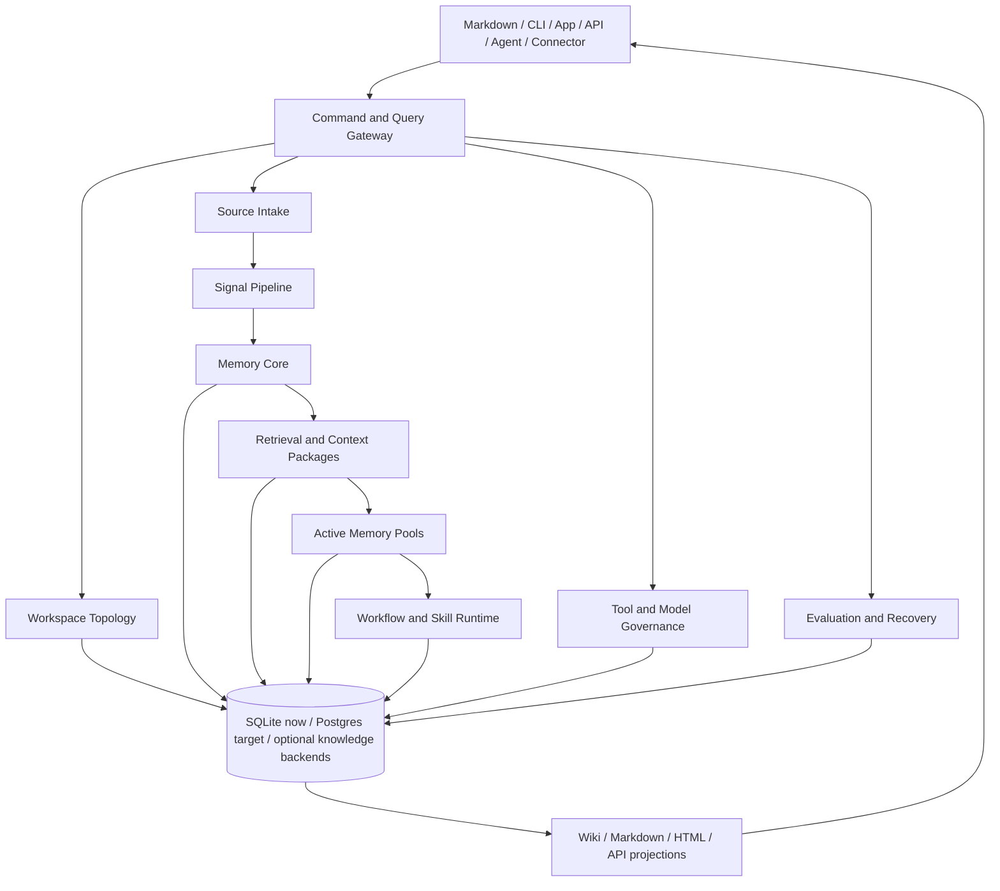
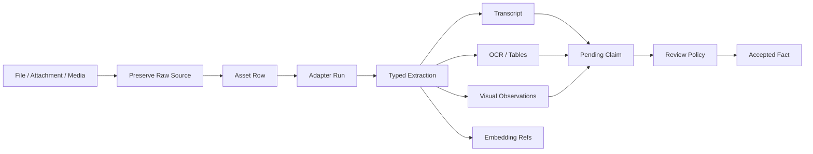

# Optimal Engine

[](https://github.com/Miosa-osa/OptimalEngine/actions/workflows/ci.yml)
[](LICENSE)
[](mix.exs)

Optimal Engine is a self-hosted second brain and operating engine for human and
AI workspaces.

It gives a person, team, or company a governed place to organize work, preserve
source evidence, build institutional memory, retrieve trusted context, operate
with agents, and project the same state into markdown, APIs, dashboards, CLI
tools, and workflows.

It is not only a notes app, a vector database, or an agent task runner. It is the
runtime underneath a workspace:

```text
Define the world    -> Organization, Workspaces, Nodes, relationships, policies
Capture evidence    -> Sources, files, messages, events, tool results
Build memory        -> Signals, Claims, Facts, Memory Objects
Use context         -> Retrieval, Context Packages, Active Memory Pools
Run work            -> Tools, models, workflows, Skill Packages
Project the state   -> Markdown, wiki pages, dashboards, exports, APIs
```

Signal classification is the front door for noisy input:

```text
Signal = Mode + Genre + Type + Format + Structure
```

The engine keeps those dimensions separate so it can route, parse, review,
package, and retrieve the input without pretending every file or message is the
same kind of thing.

See [`docs/concepts/signal-theory.md`](docs/concepts/signal-theory.md) for the
breakdown and anti-noise rules.

Most users should start by dumping messy context into the engine. The engine
preserves that input, proposes structure, asks follow-up questions, and waits for
review before turning suggestions into durable workspace truth.

## What You Can Build With It

Optimal Engine is designed for operating systems around real work:

| Use case | What the engine gives you |
| --- | --- |
| Company second brain | Source-backed memory for decisions, projects, people, customers, procedures, and institutional context. |
| Personal operating system | Workspaces for life, work, learning, people, money, projects, and daily rhythm. |
| Agent workspace | Governed Context Packages, Active Memory Pools, tool permissions, observations, and audit. |
| Research system | Source Packages, Claims, Facts, citations, relationships, retrieval, and evidence trails. |
| Project/product OS | Nodes for products, projects, features, decisions, milestones, blockers, releases, and workflows. |
| Operations/SOP system | Workflow traces, validated procedures, Skill Packages, tool calls, and exception handling. |
| Customer/support memory | Customer nodes, issue history, prior fixes, current-valid Facts, and source-linked recall. |

## Core Model

The hierarchy is intentionally simple:

```text
Tenant / Organization
  -> Workspaces
      -> Nodes
          -> attached sources, signals, memory, wiki pages, workflows, skills
```

A Project is a Node type inside a Workspace. It is not a peer of Workspace.

```text
Workspace
  -> Project Node
  -> Person Node
  -> Product Node
  -> Operational Node
  -> Context Node
  -> Learning Node
```

Users can call project-like things initiatives, campaigns, engagements, deals,
cases, programs, or accounts. The engine preserves those labels as scoped
aliases while keeping the canonical object clean:

```text
node_type: project
display_label: Initiative
display_name: Q3 Partner Launch
aliases: ["launch project", "partner launch", "q3 initiative"]
```

This matters because names are part of routing. Loose names resolve inside the
current organization/workspace scope. Ambiguous names produce a clarification
question instead of a silent durable write.

Layers are engine services that operate across the hierarchy:

```text
Workspace / Topology
Source Intake
Signal Pipeline
Memory Core
Retrieval / Context
Active Memory Pools
Workflow / Skill Runtime
Tool / Model Governance
Wiki / Export Surface
Evaluation / Audit / Recovery
```

## Operating Flow

```mermaid
flowchart LR
  Human[Human / Agent / App / Connector] --> Scope[Workspace + Node Scope]
  Scope --> Source[Source Package]
  Source --> Signal[Signal]
  Signal --> Route[Route to Node]
  Route --> Claim[Claim]
  Claim --> Review[Review / Policy]
  Review --> Fact[Fact]
  Fact --> Memory[Memory Object]
  Memory --> Recall[Retrieval]
  Recall --> Context[Context Package]
  Context --> Pool[Active Memory Pool]
  Pool --> Action[Human or Agent Action]
  Action --> Observation[Observation]
  Observation --> Claim
```



The same pattern works whether the input is a markdown edit, uploaded file,
calendar event, API payload, connector sync, tool result, or agent observation.

## Tiers, Layers, Stages, Rhythm

These concepts are still part of the engine.

### Tiers

```text
Tier 1: preserved sources and raw artifacts
Tier 2: rebuildable indexes, summaries, chunks, embeddings, projections
Tier 3: human-facing wiki/export pages and app views
```

Tier 3 is useful for humans and agents, but canonical truth lives in governed
engine objects with provenance and policy.

### Layers

```text
Topology owns the shape of the workspace.
Intake owns source preservation.
Signal owns classification.
Memory Core owns claims, facts, memories, edges, and ledger.
Retrieval owns context assembly.
Active Pools own task-local working state.
Workflow/Skill owns repeatable procedures.
Tool/Model Governance owns calls, permissions, validation, and audit.
Export owns markdown, HTML, reports, and app projections.
```

### Stages

```text
Setup workspace
  -> Create Nodes
  -> Ingest sources
  -> Classify Signals
  -> Extract Claims
  -> Promote Facts
  -> Build Memories
  -> Retrieve Context
  -> Work in Active Pools
  -> Capture Observations
  -> Promote Workflows and Skills
```

### Rhythm

Rhythm is the human operating cadence: daily focus, weekly review, node status,
open decisions, blockers, and follow-up loops. The engine treats rhythm as part
of the workspace, not as random notes.

```text
Daily work -> observations, updates, pending claims
Weekly review -> node state, priorities, decisions, stale context
Monthly review -> workspace health, workflow promotion, memory cleanup
```

## Product Surfaces

Optimal Engine is the backend runtime. Different surfaces can control or display
the same state.

| Surface | Role |
| --- | --- |
| Markdown workspace | Direct human/agent editing and portable workspace projection. |
| CLI | Fast local setup, inspection, retrieval, rendering, and verification. |
| API | App, dashboard, service, and automation integration. |
| MCP/tools | Agent-safe access to memory, retrieval, wiki, and workspace actions. |
| Wiki/export | Human-readable pages, reports, packages, and app views. |
| Database | Canonical runtime state, provenance, permissions, audit, and rebuildable projections. |

Markdown is not removed. Markdown becomes an inspectable control surface backed
by the database.

```text
Markdown edit -> Source Package or topology change -> reviewed engine state
Engine state  -> Markdown/wiki/API/dashboard projection
```

The recommended filesystem projection is:

```text
organization/
  organization.yaml
  workspaces/
    company-os/
      workspace.yaml
      AGENTS.md
      rhythm/
      nodes/
        project-platform-launch/
          node.yaml
          context.md
          signal.md
          sources/
          decisions/
          workflows/
          exports/
```

See [`docs/guides/workspace-filesystem.md`](docs/guides/workspace-filesystem.md)
for the full convention.

Packages are receiver/channel bundles, often zipped from multiple files. A
package for one project, customer, product, person, or operation belongs under
that Node:

```text
nodes/project-platform-launch/packages/partner-update/
  package.yaml
  dist/partner-update.zip
```

Workspace-level packages are only for bundles that intentionally span multiple
Nodes and declare those Nodes in a manifest.

See [`docs/guides/packages-and-exports.md`](docs/guides/packages-and-exports.md)
for package placement rules.

## Storage Vs Projection

The engine deliberately separates where data is stored from how it is organized
and displayed.

```text
Storage substrate   -> SQLite, Postgres, raw artifact storage, indexes, caches,
                       optional graph/knowledge backends.
Domain ownership    -> topology, intake, signal, memory, retrieval, active work,
                       workflow, skill, governance, evaluation.
Projection surface  -> markdown, wiki, HTML, app UI, API, MCP/tools, reports,
                       agent context packages.
```

The database stores governed runtime state. Markdown, wiki pages, app views,
HTML, reports, and agent prompts are projections or control surfaces. If a human
edits a projection, that edit re-enters the engine as source evidence or a
reviewed topology change instead of silently overwriting truth.

See [`docs/architecture/STORAGE-AND-PROJECTION-MAP.md`](docs/architecture/STORAGE-AND-PROJECTION-MAP.md)
for the full map.

For scope switching rules across organization, workspace, Node, and task pool,
read [`docs/guides/scope-switching.md`](docs/guides/scope-switching.md).

For installation profiles, local vs enterprise storage, Docker, multimodality,
and adapter setup, read
[`docs/guides/installation-and-deployment.md`](docs/guides/installation-and-deployment.md).

For canonical naming, aliases, and how the engine handles user-specific labels,
read [`docs/guides/naming-and-aliases.md`](docs/guides/naming-and-aliases.md).

For common communication channels, imports from old systems, connector types,
and recurring package types such as proposals, contracts, SOPs, and client
requirements, read
[`docs/guides/integrations-and-imports.md`](docs/guides/integrations-and-imports.md).

For the recommended documentation path, start at
[`docs/README.md`](docs/README.md).

For the backend-first build plan, layer guide, and diagrams showing what each
part is used for, read [`docs/ROADMAP.md`](docs/ROADMAP.md).

## Repository Layout

The top-level folders are product surfaces, not random piles of code:

| Path | Purpose |
| --- | --- |
| `lib/` | Elixir/OTP runtime: topology, intake, memory, retrieval, API, wiki/export, governance, evaluation. |
| `test/` | Runtime, API, topology, wiki, memory, connector, and evaluation tests. |
| `apps/` | App surfaces such as docs and MCP server packages. |
| `desktop/` | Desktop/app shell surface. |
| `extensions/` | Browser and Raycast integration surfaces. |
| `sdks/` | TypeScript, Python, and UI/client SDKs. |
| `site/` | Public site surface. |
| `skills/` | Agent skill package for using the engine from coding assistants. |
| `sample-workspace/` | Example workspace convention for new users. |
| `deploy/` | Docker/production deployment assets. |
| `docs/` | Reference docs for concepts, architecture, data model, operations, and build alignment. |

Generated dependency folders, local databases, build outputs, and generated
binaries are intentionally ignored. They should be rebuilt locally, not tracked.

## First-Run Initiation

The first real workflow is not a perfect form. It is a data dump.

```text
User dumps messy context
  -> engine preserves the dump as a Source Package
  -> engine extracts an unreviewed setup Claim
  -> engine proposes Nodes and integration surfaces
  -> human or policy review accepts/rejects structure
  -> approved Nodes become workspace topology
  -> future sources route into the approved topology
```

Run it with a markdown or text file:

```bash
mix optimal.initiate my-workspace --name "My Workspace" --dump setup.md
```

The initiation command is conservative by design. It creates pending topology
change requests instead of silently creating durable Nodes from guesses.

It also inventories outside systems mentioned in the dump:

```text
MCP servers
connector syncs
custom APIs
scripts and cron jobs
model/tool calls
local files and markdown folders
third-party systems such as calendar, mail, calls, tickets, repos, CRM, docs
```

Those become disabled governed tool definitions until the user confirms
credentials, scopes, allowed Nodes/partitions, read/write policy, and which
actions require confirmation.

## Architecture



The physical database can be shared. Ownership is not shared. Each table group
has an owning layer and a lifecycle.

| Table group | Owner |
| --- | --- |
| `workspaces`, `nodes`, `node_types`, `node_relationships`, `node_members` | Workspace / Topology |
| `source_packages`, `claims`, `facts`, `memory_objects`, `relationship_edges`, `derivation_ledger` | Memory Core |
| `assets`, `asset_adapter_runs`, `asset_extractions`, transcript/OCR/visual projection rows | Memory Core / Pipeline |
| `contexts`, FTS/search projections, signal metadata | Signal/Search compatibility |
| `context_packages`, retrieval plans, retrieval audit | Retrieval / Context |
| `active_memory_pools`, observations, loaded context links | Active Work |
| `workflow_traces`, `generalized_workflows`, `procedural_memory_objects`, `skill_packages` | Workflow / Skill Runtime |
| `model_call_operations`, `mcp_tool_definitions`, call runs | Tool / Model Governance |
| `wiki_pages`, `export_records`, `projection_revisions`, `link_health_records` | Wiki / Export |
| `evaluation_runs`, `evaluation_cases` | Evaluation |

## Memory Lifecycle

Optimal Engine separates what was said from what is accepted as true.

```text
Source Package
  -> Signal
  -> Claim
  -> Fact
  -> Memory Object
  -> Context Package
  -> Active Memory Pool
  -> Observation
  -> Pending Claim
```

This prevents an agent, parser, connector, or markdown edit from silently
becoming truth.

Facts and Memory Objects can carry:

```text
source links
evidence links
confidence
precision
valid time
transaction time
security labels
partition scope
review state
supersession state
derivation ledger links
```

## Multimodal Evidence

Text is not the only source. Files and media enter the same governed lifecycle.



Supported input families include:

```text
text
documents
code
images
audio
video
calendar/events
messages/conversations
tickets/tasks
database/API payloads
tool results
workspace projection edits
```

The current open-source adapter registry is in:

```text
lib/optimal_engine/pipeline/multimodal_tool_registry.ex
docs/reference/multimodal-open-source-stack.md
```

Deployments choose which heavier local tools to install. Missing adapters should
degrade gracefully: raw evidence is still preserved, and unavailable runs are
recorded instead of being hidden.

## Quick Start

Requirements:

- Elixir `~> 1.17`
- Erlang/OTP 26+
- Node 20+ for app/site surfaces
- A local C toolchain for optional native dependencies

Run the engine locally:

```bash
mix deps.get
mix compile
mix optimal.reality_check
```

Create a markdown-operable workspace:

```bash
mix optimal.initiate my-workspace --name "My Workspace" --dump setup.md
mix optimal.setup my-workspace --name "My Workspace"
mix optimal.topology --workspace default:my-workspace
```

Use `optimal.initiate` when starting from a messy dump. Use `optimal.setup` when
you already know the workspace and starter Nodes you want.

Render wiki/export projections:

```bash
mix optimal.wiki render-node first-project --workspace default:my-workspace
mix optimal.wiki render-tree --workspace default:my-workspace
mix optimal.wiki check node-first-project --workspace default:my-workspace
```

Ask the engine:

```bash
mix optimal.search "project"
mix optimal.rag "what changed this week?"
```

## Agent SOP

A coding agent or assistant should use the engine in this order:

```text
1. Inspect workspace topology.
2. Retrieve a governed Context Package.
3. Work inside the current task scope.
4. Use registered tools or APIs.
5. Record observations.
6. Promote useful observations to pending Claims.
7. Let review/policy promote Claims into Facts.
8. Export markdown/wiki/app views from engine state.
```

Agents should not bypass Memory Core by writing final truth directly into
markdown or raw tables.

Agents should also not call arbitrary outside systems directly. Whether the
surface is MCP, a connector, an API, or a script, it should be registered,
permissioned, schema-checked, executed, logged, and converted back into Source
Packages or observations when it produces useful evidence.

## Docker And Deployment

Docker is optional.

Use local Elixir/SQLite for development and personal use:

```text
.optimal/index.db
```

Use Docker or a managed runtime when you want a packaged service stack:

```bash
docker compose -f deploy/docker-compose.yml up
```

The target production database is Postgres. The architecture is built so the
physical store can change while layer ownership stays the same.

```text
SQLite now: local canonical runtime store
Postgres target: production canonical runtime store
FTS/vector/index/cache rows: rebuildable projections
ETS/RocksDB/Mnesia/Riak knowledge backends: optional graph/triple-store engines
Markdown/files/wiki/HTML/API: export and control surfaces
```

RocksDB is not the main workspace database today. It is an optional persistent
knowledge backend for graph/triple-store workloads when the runtime has the
required native RocksDB library available.

## Verification

Core reality check:

```bash
mix optimal.reality_check
```

Current verified result:

```text
126 probes, 126 ok, 0 warn, 0 fail
```

Focused topology/wiki path:

```bash
mix test test/wiki/service_test.exs \
  test/wiki/store_test.exs \
  test/workspace_export_test.exs \
  test/mix_tasks/optimal_setup_test.exs \
  test/workspace_initiation_test.exs \
  test/mix_tasks/optimal_initiate_test.exs \
  --seed 0
```

Current result:

```text
19 tests, 0 failures
```

Focused multimodal/memory path:

```bash
mix test test/memory_core/spine_test.exs \
  test/pipeline/multimodal_adapter_runner_test.exs \
  test/memory_core/asset_store_test.exs \
  --seed 0
```

## What Is Built

The runtime already includes:

- Workspace topology with Workspaces, Nodes, Node Types, relationships,
  membership, setup CLI, and filesystem projections.
- First-run workspace initiation from messy context dumps, with preserved source
  evidence, pending setup Claims, proposed Nodes, open questions, and disabled
  integration placeholders.
- Source Package preservation for raw text and governed assets.
- Signal classification and compatibility search rows.
- Claim, Fact, Memory Object, Relationship Edge, and Derivation Ledger tables.
- Fact promotion, stale/conflict handling, supersession, and context invalidation.
- Context Packages with permission-aware package assembly.
- Active Memory Pools with load, refresh, observe, and close flows.
- Multimodal asset preservation, adapter run records, typed extraction
  projections, and derived pending Claims.
- Tool/model governance run records and permission checks.
- Connector and integration governance for MCP, connector, API, and script
  surfaces before agents can use outside systems.
- Wiki/export rendering for Node pages and workspace tree pages.
- Evaluation run/case records and JSON/JSONL dataset execution.
- Reality check probes across the major runtime paths.

## Roadmap

The backend-first roadmap is organized as build gates:

```text
Workspace Topology
  -> Source-First Intake
  -> Signal and Multimodal Processing
  -> Claim, Fact, and Memory Review
  -> Retrieval and Context Packages
  -> Agent Runtime and Tool Governance
  -> Workflow and Skill Lifecycle
  -> Projection and Business OS Integration
  -> Evaluation, Recovery, and Production Hardening
```

Read the full roadmap, diagrams, layer guide, and "what each part is used for"
here:

[`docs/ROADMAP.md`](docs/ROADMAP.md)

## Development Rule

Do not make `Store` the owner of business meaning.

Good:

```text
WorkspaceTopology.create_node(...)
MemoryCore.extract_claim(...)
MemoryCore.promote_claim_to_fact(...)
MemoryCore.retrieve(...)
MemoryCore.open_active_pool(...)
WorkspaceExport.project(...)
```

Avoid:

```text
Store.create_fact(...)
Store.publish_observation(...)
Context.make_truth(...)
raw SQL from feature modules into governed tables
```

`Store` can execute database writes. Domain layers own lifecycle decisions.

## License

Optimal Engine is released under the [MIT License](LICENSE).
