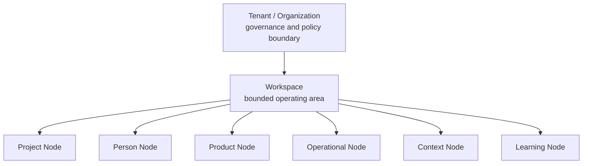
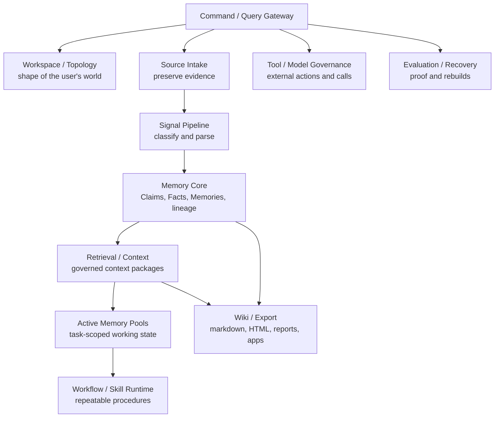
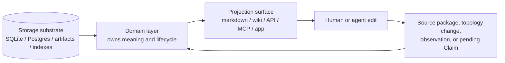
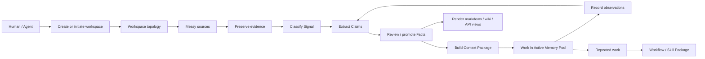
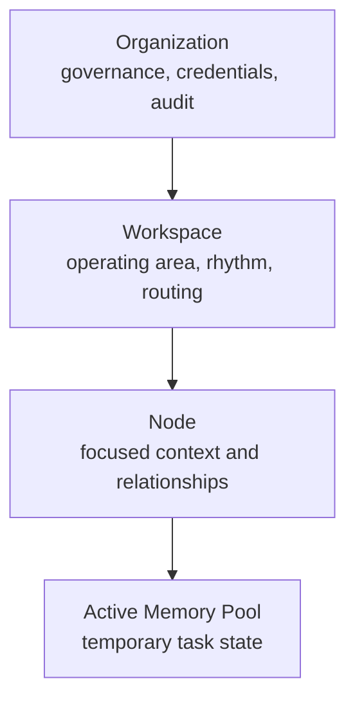

# Optimal Engine Documentation

This is the canonical documentation path for understanding and using Optimal
Engine.

Optimal Engine is a self-hosted second brain and operating engine for human and
AI workspaces. It is not only a database, not only a markdown workspace, and not
only an agent runner. It is the runtime that connects those surfaces through
governed topology, source evidence, memory, retrieval, workflows, tools, and
projections.

## Start Here

Read these in order:

0. [Agent boot](../AGENTS.md)
   The repo-level boot contract for agents: canonical repo, local startup,
   runtime data boundary, store model, isolation rules, and verification before
   push.

1. [Getting started](guides/getting-started.md)
   Install, run the engine, create a workspace, initiate from a messy dump, and
   inspect the result.

2. [First workspace story](guides/first-workspace-story.md)
   How a user brings existing markdown, company wiki pages, tools, packages,
   channels, and messy context into a self-updating workspace.

3. [Roadmap](ROADMAP.md)
   Backend-first build gates, layer guide, diagrams, and what each part is used
   for.

4. [Engine structure](architecture/ENGINE-STRUCTURE.md)
   The clean system map: organization, workspace, nodes, layers, stores,
   projections, agents, and loops.

5. [Storage and projection map](architecture/STORAGE-AND-PROJECTION-MAP.md)
   Which substrate stores what, which layer owns meaning, and which surfaces
   display/control the state.

6. [Storage capabilities and workspace flow](architecture/STORAGE-CAPABILITIES-AND-WORKSPACE-FLOW.md)
   How local-first storage expands into self-hosted, cloud, and Fractal enterprise capabilities without changing workspace ownership or module contracts.

7. [Store and layer reality](guides/store-and-layer-reality.md)
   Plain-language explanation of what actually runs, which stores are required,
   which are optional, how RAG and graph views fit, and how to verify each layer.

8. [Installation and deployment](guides/installation-and-deployment.md)
   Local CLI setup, Docker, production/organization setup, store roles,
   multimodality profiles, and enterprise readiness.

9. [Signal theory](concepts/signal-theory.md)
   How the engine breaks noisy input into Mode, Genre, Type, Format, and
   Structure before routing, extracting, packaging, or retrieving it.

10. [Workspace filesystem](guides/workspace-filesystem.md)
   What the markdown/file projection looks like and how edits flow back into
   governed engine state.

11. [Scope switching](guides/scope-switching.md)
   How organization, workspace, Node, and Active Memory Pool scope affect
   permissions, retrieval, routing, tools, and exports.

12. [Naming and aliases](guides/naming-and-aliases.md)
   How user language maps to canonical engine objects without creating routing
   noise.

13. [Packages and exports](guides/packages-and-exports.md)
   Where receiver/channel bundles live, how they differ from exports, and why
   Node-owned packages stay under Nodes.

14. [Integrations and imports](guides/integrations-and-imports.md)
   How to inventory existing systems, connect common communication channels,
   import old context, and define recurring package types.

15. [Agent and CLI SOP](guides/agent-cli-sop.md)
   How a human, Codex, Claude Code, an MCP client, a script, or an app should
   operate the system without bypassing governance.

16. [Tool surfaces and loops](guides/tool-surfaces-and-loops.md)
   When to use CLI, MCP, A2A, APIs, connectors, scripts, and scheduled jobs,
   and how self-updating loops feed back into memory.

17. [Interfaces and publishing](guides/interfaces-and-publishing.md)
   How custom apps, dashboards, MCP clients, public links, static sites,
   package delivery flows, and deployment tools should sit on top of the
   backend without becoming a second source of truth.

18. [Agentic loops](guides/agentic-loops.md)
   How goal-driven and scheduled loops use context, tools, validation gates,
   stop conditions, observations, workflow traces, and review.

19. [Backend readiness](reference/backend-readiness.md)
   What is actually built in the backend, which stores own what, which checks
   prove it, and what still needs hardening.

20. [Build goal alignment](reference/build-goal-alignment.md)
   What is built now, what is only a spine, what still needs work, and which
   tests/probes prove it.

## Core Mental Model

```text
Tenant / Organization
  -> Workspaces
      -> Nodes
          -> Sources, Signals, Claims, Facts, Memories, Workflows, Skills
```

Projects are Nodes inside a Workspace. They are not peers of Workspace.



The runtime is organized by lifecycle ownership:



## Store Vs Layer Vs Surface

Use these terms precisely:

| Term | Meaning | Examples |
| --- | --- | --- |
| Storage substrate | Where bytes or records physically live. | SQLite, Postgres, raw artifact storage, FTS/vector indexes, cache directories, optional graph backends. |
| Domain layer | The owner of lifecycle and meaning. | Topology, Memory Core, Retrieval, Workflow, Governance. |
| Projection surface | A way humans, agents, apps, or tools see/control state. | Markdown, wiki, HTML, API, MCP, desktop app, reports, agent context packages. |

The same information can appear in many surfaces, but one layer owns the
canonical lifecycle.



## Current Default Stores

| Store | Current role |
| --- | --- |
| SQLite | Local canonical runtime store today. |
| Postgres | Target production canonical runtime store. |
| Raw artifact storage | Preserved files, uploads, attachments, and media evidence. |
| FTS/vector/chunk indexes | Rebuildable retrieval projections. |
| Cache directories | Rebuildable parse, embedding, and runtime acceleration. |
| ETS/RocksDB/Mnesia/Riak-style backends | Optional graph/knowledge backends; not the main workspace database today. |
| Markdown/files | Human-operable projection and editing surface. |
| HTML/wiki/API/app views | Projection and control surfaces. |

For install profiles, Docker guidance, hosted/local multimodal adapter options,
and enterprise readiness checks, read
[Installation and deployment](guides/installation-and-deployment.md).

## User And Agent Flow



Humans and AI agents use the same backend state. They use different surfaces:
markdown, CLI, API, MCP/tools, wiki/export, or an external app.

## Filesystem Projection

The recommended markdown projection looks like this:

```text
organization/
  organization.yaml
  workspaces/
    company-os/
      workspace.yaml
      AGENTS.md
      rhythm/
      nodes/
        project-platform-launch/
          node.yaml
          context.md
          signal.md
          sources/
          decisions/
          workflows/
          exports/
```

This is how people can see and operate the system directly. The database still
owns canonical identity, permissions, lineage, memory, retrieval, workflow, and
audit state.

## Scope Switching



Switch organization when ownership or policy changes. Switch workspace when the
operating context changes. Switch Node when the focus changes inside a
workspace. Open an Active Memory Pool when a bounded human/agent task starts.

## Naming Discipline

Different organizations can call the same shape different things. The engine
preserves user language as aliases while keeping canonical object types stable:

```text
node_type: project
display_label: Initiative
display_name: Q3 Partner Launch
aliases: ["launch project", "partner launch", "q3 initiative"]
```

If a loose name maps to more than one active object in the current scope, the
engine asks for clarification before writing durable state.

## Canonical Docs

### Use And Operation

- [Roadmap](ROADMAP.md)
- [Getting started](guides/getting-started.md)
- [Workspace filesystem](guides/workspace-filesystem.md)
- [Scope switching](guides/scope-switching.md)
- [Naming and aliases](guides/naming-and-aliases.md)
- [Packages and exports](guides/packages-and-exports.md)
- [Agent and CLI SOP](guides/agent-cli-sop.md)
- [Mix tasks](guides/mix-tasks.md)
- [Writing guide](guides/writing-guide.md)

### Architecture

- [Engine structure](architecture/ENGINE-STRUCTURE.md)
- [Storage and projection map](architecture/STORAGE-AND-PROJECTION-MAP.md)
- [Storage capabilities and workspace flow](architecture/STORAGE-CAPABILITIES-AND-WORKSPACE-FLOW.md)
- [Workspace architecture](architecture/WORKSPACE.md)
- [Wiki layer](architecture/WIKI-LAYER.md)

### Reference

- [Build goal alignment](reference/build-goal-alignment.md)
- [Data model](reference/data-model.md)
- [Component map](reference/components.md)
- [Multimodal open-source stack](reference/multimodal-open-source-stack.md)
- [Search architecture](reference/search-architecture.md)
- [Operations spec](reference/operations-spec.md)
- [Agent hooks](reference/hooks.md)
- [Session lifecycle](reference/session-lifecycle.md)
- [Node template](reference/node-template.md)
- [Vocabulary](reference/vocabulary.md)

### Concepts

- [Signal theory](concepts/signal-theory.md)
- [Failure modes](concepts/failure-modes.md)

## Documentation Rule

This docs tree is intentionally current-only. Historical strategy notes,
private examples, and comparison research do not belong in the public product
documentation path. If a document is not linked from this page, treat it as
non-canonical until it is reviewed and added here.

## Verification

The broad runtime check is:

```bash
mix optimal.reality_check
```

Current expected result:

```text
126 probes, 126 ok, 0 warn, 0 fail
```
