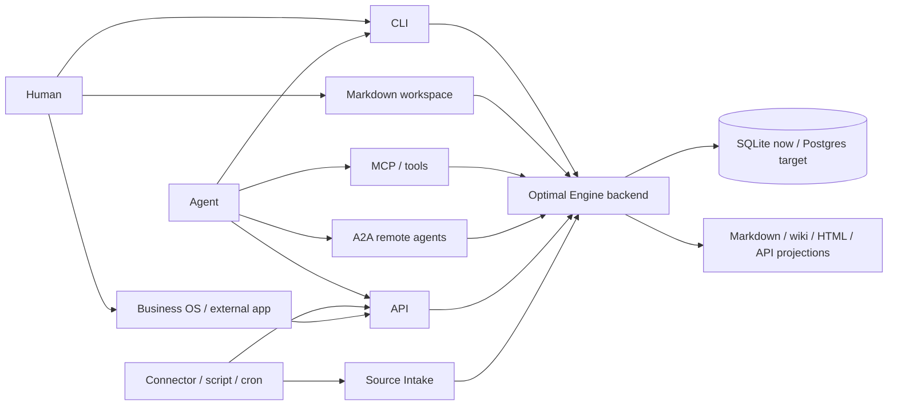
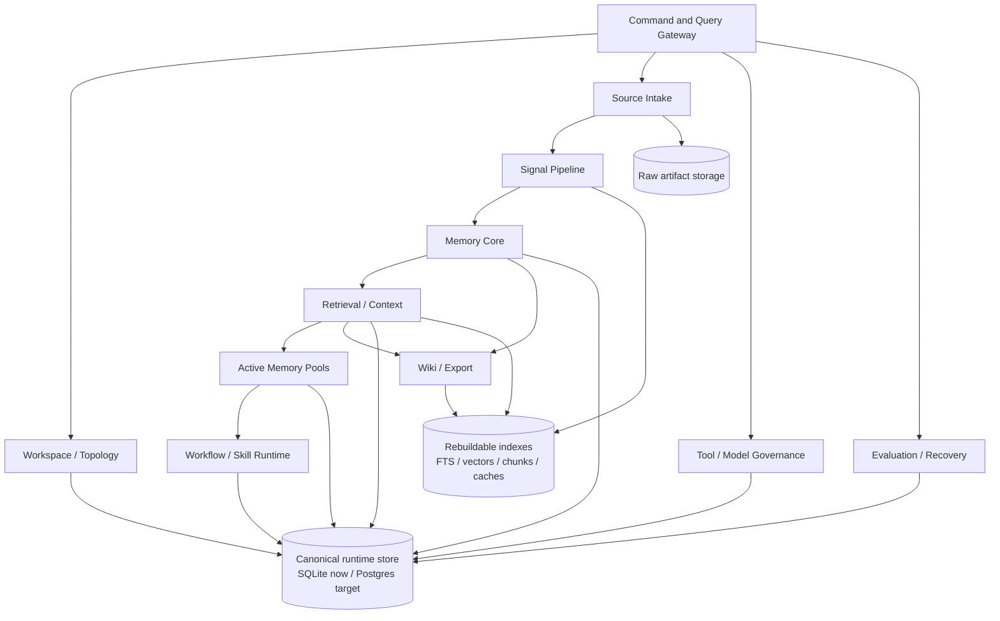
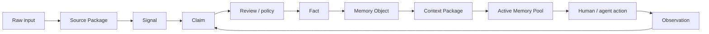
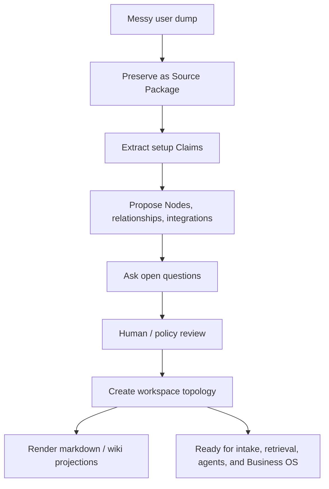

# Roadmap

Optimal Engine is the backend runtime for a second brain, company memory, and
agent-operated workspace.

It does not need to be the main frontend. Frontends such as Business OS,
dashboards, mobile apps, internal tools, or agent CLIs should connect to it
through CLI, API, MCP/tools, A2A agent delegation, SDKs, markdown projections,
and wiki/export output.

## What This System Is

```text
Optimal Engine
  = backend operating engine
  = workspace topology
  + source evidence
  + signal classification
  + governed memory
  + retrieval/context packages
  + agent/tool governance
  + workflow/skill lifecycle
  + projection/export layer
```

It is not trying to be one specific app UI. It is the runtime underneath many
interfaces.

## Who Uses Which Surface



| Surface | What it is for | What it should not do |
| --- | --- | --- |
| CLI | Local setup, initiation, inspection, retrieval, verification, and scripted operation. | Become a separate truth system. |
| API | Business OS, dashboards, services, SDKs, and automation clients. | Invent a different data model. |
| MCP/tools | Agent-safe access to memory, retrieval, workspace, and tool actions. | Let agents bypass permissions or review. |
| A2A agents | Delegating or coordinating work with other agents. | Replace tool/data integrations such as files, databases, calendars, or repos. |
| Markdown workspace | Human/agent-operable projection and editing surface. | Silently overwrite canonical truth. |
| Wiki/export | Human-readable pages, reports, packages, and app-ready projections. | Decide what is true. |
| Business OS / external UI | Product interface over engine state. | Reimplement memory, retrieval, or governance separately. |

For the practical filesystem projection, see
[`guides/workspace-filesystem.md`](guides/workspace-filesystem.md).

For organization/workspace/Node/task scope rules, see
[`guides/scope-switching.md`](guides/scope-switching.md).

For canonical naming and aliases, see
[`guides/naming-and-aliases.md`](guides/naming-and-aliases.md).

For package placement and receiver/channel bundles, see
[`guides/packages-and-exports.md`](guides/packages-and-exports.md).

## System Map



## Layer Guide

| Layer | Why it exists | Stores/owns | Main users |
| --- | --- | --- | --- |
| Workspace / Topology | Defines the shape of the user or organization's world. | tenants, workspaces, nodes, node types, node relationships, memberships, routing rules. | Humans, Business OS, agents, connectors. |
| Source Intake | Preserves evidence before interpretation. | source packages, raw artifact records, hashes, source metadata. | CLI/API/connectors/agents. |
| Signal Pipeline | Classifies noisy input so the engine knows what kind of thing arrived. | signal metadata, parser output, chunks, compatibility search rows. | Intake, retrieval, routing. |
| Memory Core | Separates what was said from what is accepted as true. | claims, facts, memory objects, relationship edges, derivation ledger, temporal validity. | Retrieval, agents, apps, review workflows. |
| Retrieval / Context | Gives humans and agents the right authorized context for a task. | context packages, retrieval plans, audit, stale package state. | Agents, Business OS, CLI/API. |
| Active Memory Pools | Holds task-local working memory while humans and agents do work. | pools, loaded context, observations, pending claims. | Agents, collaborators, task runners. |
| Workflow / Skill Runtime | Turns repeated work into reusable procedures. | workflow traces, generalized workflows, procedural memories, skill packages. | Agents, operations, SOP flows. |
| Tool / Model Governance | Controls what agents, tools, scripts, MCPs, APIs, and models are allowed to do. | tool definitions, model definitions, grants, call runs, validation, audit. | Agents, connectors, automation. |
| Wiki / Export | Projects governed state into readable files, pages, reports, and app/API views. | export records, wiki pages, projection revisions, link health. | Humans, Business OS, agents. |
| Evaluation / Recovery | Proves the engine works and can rebuild derived artifacts. | evaluation runs, cases, benchmark records, rebuild checks. | Developers, operators, CI. |

## Data Lifecycle



The rule:

```text
Sources are evidence.
Signals are classification.
Claims are unaccepted assertions.
Facts are accepted assertions.
Memory Objects explain meaning.
Context Packages feed humans and agents.
Observations loop back as pending Claims.
```

## Workspace Setup Lifecycle



This is the first important user workflow. A user should be able to dump messy
context, let an agent help structure it, and review before the system commits
durable topology.

## Why The Wiki Exists

The wiki is not the database. The wiki is the readable operating surface.

Use it for:

```text
node pages
current summaries
source-linked explanations
reports
packages
Business OS display material
agent-readable curated context
```

Do not use it for:

```text
silent truth promotion
untracked agent edits
source-free claims
long-term storage without provenance
```

Wiki/export output is useful because humans and apps need readable pages. It is
safe because durable changes re-enter the engine as Source Packages, topology
change requests, observations, or pending Claims.

## Why The Database Exists

The database is the governed runtime state.

It stores:

```text
workspace identity
nodes and relationships
source packages
claims and facts
memory objects
context packages
active pools
workflow and skill records
tool/model call records
audit and evaluation records
```

It does not replace markdown or apps. It makes them consistent, searchable,
auditable, permission-aware, and rebuildable.

## Why Connectors, MCPs, APIs, A2A, Scripts, And Cron Exist

Different users already work across different systems. Optimal Engine should not
force everything through one interface.

| Integration type | Use it when | Engine rule |
| --- | --- | --- |
| MCP | An agent needs a standard tool protocol. | Register tool, validate input/output, audit calls. |
| A2A | Another agent needs to receive, negotiate, coordinate, stream progress, or return artifacts. | Register remote agent, check delegation policy, preserve returned work. |
| Connector | A third-party system needs sync/import. | Preserve raw payloads, scope credentials, create Sources/observations. |
| API | Business OS or another app needs programmatic control. | Use engine objects and lifecycle rules. |
| Script | A local workflow needs deterministic automation. | Treat output as Source Package or observation. |
| Cron/job | A recurring sync, refresh, benchmark, or rebuild is needed. | Record run state and audit. |

## Build Gates

The roadmap is organized as gates. A gate is complete when the backend behavior
is implemented, tested, documented, and exposed through at least one usable
surface.

### Gate 1: Workspace Topology

Goal:

```text
Organizations can have workspaces.
Workspaces can have Nodes.
Nodes have types, relationships, members, status, and projections.
Projects are Nodes inside Workspaces.
Aliases preserve user vocabulary without changing canonical object types.
```

Done when:

```text
CLI/API can create and inspect topology.
Topology changes are reviewed when proposed by agents.
Markdown/wiki projections render from topology.
Business OS can consume the same topology through API.
```

### Gate 2: Source-First Intake

Goal:

```text
Every input is preserved before interpretation.
```

Done when:

```text
CLI/API/connectors/agents can submit text, files, tool results, and projection edits.
Raw evidence is hashed, scoped, permissioned, and linked to derived objects.
No path writes Claims/Facts without source evidence.
```

### Gate 3: Signal And Multimodal Processing

Goal:

```text
The engine classifies text, documents, images, audio, video, API payloads,
tool results, and markdown edits into typed Signals and derived extractions.
```

Done when:

```text
Adapter runs are recorded.
Missing tools degrade gracefully.
Typed extractions are searchable and claimable where appropriate.
Model outputs remain pending Claims, not Facts.
```

### Gate 4: Claim, Fact, And Memory Review

Goal:

```text
The engine separates extracted assertions from accepted truth.
```

Done when:

```text
Review queue is usable through CLI/API.
Promotion records evidence, validity, confidence, precision, supersession, and audit.
Contradictions and stale context are handled explicitly.
```

### Gate 5: Retrieval And Context Packages

Goal:

```text
Humans and agents receive governed Context Packages, not random chunks.
```

Done when:

```text
Retrieval uses authorization, structured filters, FTS, vector, graph, temporal,
workflow, and modality signals.
Every returned package includes sources, validity, confidence, precision, and audit.
Stale packages refresh safely.
```

### Gate 6: Agent Runtime And Tool Governance

Goal:

```text
Agents can work through CLI/API/MCP/tools/A2A without bypassing governance.
```

Done when:

```text
Tool definitions, model operations, permissions, schemas, confirmations, call
runs, observations, and audit are complete.
Codex, Claude Code, MCP clients, scripts, and Business OS agents use the same backend.
Remote agents can be delegated to only through reviewed agent definitions,
Agent Cards, grants, returned-artifact preservation, and audit.
```

### Gate 7: Workflow And Skill Lifecycle

Goal:

```text
Repeated work becomes reusable governed procedure.
```

Done when:

```text
Episodes create workflow traces.
Similar traces become generalized workflows.
Reviewed workflows become procedural memories.
Approved procedures become Skill Packages with preconditions, tools, checks,
exceptions, rollback, permissions, and audit.
```

### Gate 8: Projection And Business OS Integration

Goal:

```text
Business OS and other clients can display/control engine state without
duplicating the engine.
```

Done when:

```text
API contracts are stable.
Wiki/export records carry source links and freshness.
Markdown and HTML projections are rebuildable.
External clients can render workspaces, nodes, memory, context, workflows,
skills, runs, and review queues.
```

### Gate 9: Evaluation, Recovery, And Production Hardening

Goal:

```text
The engine can prove behavior, survive rebuilds, and run in production.
```

Done when:

```text
Benchmarks run through the same retrieval path.
Derived indexes/projections can be rebuilt.
Postgres deployment is hardened.
Credentials, retention, audit, observability, backups, and migrations are production-ready.
```

## Current State

The backend spine is in place:

```text
workspace topology
source packages
claims/facts/memory objects
derivation ledger
context packages
active memory pools
workflow/skill records
tool/model governance records
wiki/export projections
multimodal asset/extraction tables
reality checks and focused tests
```

The product is not complete until the gates above are closed through CLI/API/MCP,
A2A where agent delegation is needed, and Business OS integration. The next
work should stay backend-first.

## How To Decide Where New Work Belongs

For every new feature, answer:

```text
Is this a storage substrate, a domain layer, or a projection surface?
Who owns the lifecycle?
Does it preserve evidence?
Does it create Claims or Facts?
Can it be rebuilt?
Who can retrieve it?
Which interface should expose it first: CLI, API, MCP, A2A, markdown, or export?
What test proves it?
```

If those answers are unclear, the feature is not ready to be added.
