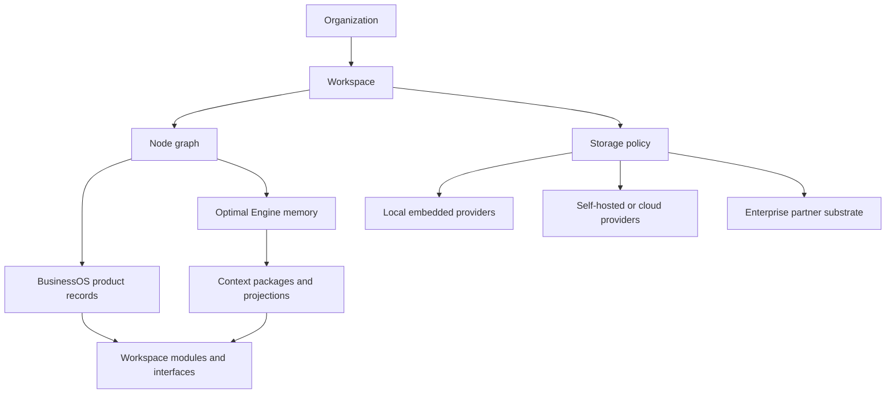
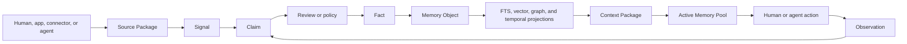
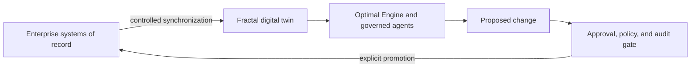
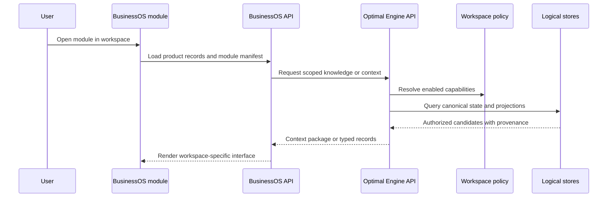

# Storage Capabilities And Workspace Flow

Optimal Engine is local-first.

Every workspace starts with private embedded storage and can add self-hosted, cloud, or enterprise capabilities only when its workload requires them.

The storage policy is workspace-scoped, explicit, versioned, and separate from credentials.

## System Boundary

BusinessOS owns product records, module configuration, permissions, and user-facing interfaces.

Optimal Engine owns source evidence, signals, claims, facts, memory objects, provenance, retrieval, context packages, and knowledge projections.

BusinessOS modules call stable APIs instead of reading physical databases directly.



An organization can contain many workspaces.

Each workspace can have different Nodes, modules, people, policies, connectors, retention requirements, and storage capabilities.

A Project is a Node inside a workspace, not a replacement for the workspace.

## Memory Lifecycle

The engine separates what was received from what has been accepted as true.



Raw connector payloads and files remain evidence.

Signals classify the evidence by mode, genre, type, format, and structure.

Claims are proposals that can be reviewed or promoted by policy.

Facts are accepted, temporal assertions with provenance.

Memory Objects make accepted knowledge reusable across retrieval and work.

Full-text, vector, graph, analytical, and UI records are projections that can be rebuilt.

## Capability Ladder

### Tier 0: Local Desktop

Every new workspace begins with the `desktop_local` use case.

SQLite stores canonical relational state, FTS5 provides lexical retrieval, embedded vectors provide semantic retrieval, RocksDB accelerates graph traversal, the filesystem stores artifacts, and ETS provides ephemeral cache and coordination.

This tier has no external service dependency and remains the preferred shape for one person, one device, private work, development, and offline operation.

### Tier 1: Self-Hosted Team

PostgreSQL, Garage or another S3-compatible object store, NATS JetStream, Valkey, and OpenBao can be provisioned when a workspace needs concurrent users, durable objects, replayable ingestion, distributed coordination, or centralized secrets.

These services are optional.

Their presence never silently moves canonical data away from the local engine.

Canonical cutover requires an explicit migration, validation, and rollback plan.

### Tier 2: Cloud Scale

Managed PostgreSQL, S3-compatible object storage, NATS, Valkey, Qdrant, and analytical DuckDB or Parquet projections can replace self-hosted equivalents when availability, throughput, regional access, or operational scale requires them.

Qdrant is an optional high-scale semantic projection and never becomes accepted truth.

DuckDB and Parquet are analytical projections and never become the transactional source of truth.

### Tier 3: Enterprise Fractal Substrate

Fractal Computing is an enterprise partner integration for governed AI over protected systems of record.

Fractal is cloud and enterprise infrastructure, not a default local dependency.

The intended boundary is a synchronized digital twin of structured source systems, with AI operating against the twin and changes promoted back through an explicit, auditable process.

Performance and cost-reduction figures associated with Fractal are Fractal's public claims and must be attributed to Fractal when used externally.

See [Fractal Computing](https://fractal-computing.com/) for its current product description.



## Provider Matrix

| Provider | Default role | Use it when | Do not use it as |
| --- | --- | --- | --- |
| SQLite | Local canonical relational store | Private desktop, offline, single node, local development | A shared multi-writer service across machines |
| FTS5 | Lexical projection | Exact terms, names, phrases, and BM25 retrieval | Canonical memory |
| Embedded vectors | Semantic projection | Local semantic recall at moderate scale | Accepted truth |
| RocksDB | Graph projection | Local relationship traversal and multi-hop retrieval | The only source of relationship lineage |
| Filesystem | Local artifact store | Local files, source evidence, exports, and backups | Shared cloud object storage |
| ETS | Ephemeral cache | Hot context and local coordination | Durable state |
| PostgreSQL | Team canonical relational provider | Concurrent writers, high availability, PostGIS, or time-series extensions | An automatic drop-in until migration checks pass |
| S3 or Garage | Shared artifact provider | Large media, attachments, backups, and multi-device access | Relational truth |
| NATS JetStream | Event and replication transport | Replayable connector ingestion, jobs, and device synchronization | Canonical business state |
| Valkey | Distributed ephemeral provider | Cache, rate limits, locks, and short-lived coordination | Durable truth |
| Qdrant | High-scale vector projection | Large vector collections and metadata filtering | Facts or provenance |
| DuckDB and Parquet | Analytical projection | Large reports, historical analysis, and cross-workspace aggregates | Transactional writes |
| OpenBao | Secret and key provider | Centralized secrets, PKI, rotation, and regulated deployments | Workspace content storage |
| Fractal | Enterprise digital-twin substrate | Protected enterprise systems, isolated AI workloads, and governed promotion | A local default or an ungoverned write path |

## Activation Rules

A provider has one of five lifecycle states.

`active` means a default local provider is currently part of the running engine.

`not_configured` means required configuration references are absent.

`configured_unverified` means configuration references exist but no successful probe has proven reachability.

`available` means a health probe succeeded and the provider can enter an explicit activation or migration process.

`unavailable` means configuration exists but the health probe failed.

The planner reports `ready: true` only when every selected provider is `active` or `available`.

Configuration values and credentials are never returned by the provider API and are never stored in workspace policies.

Workspace policy stores provider identifiers, use cases, lifecycle choices, and references only.

## Workspace Policy And Replication

Migration 52 creates a storage policy for every existing active workspace and seeds it with `desktop_local`.

Every future workspace receives the same policy during topology creation.

The replication ledger is append-only, workspace-scoped, idempotent, and ordered by a monotonic sequence.

Replica cursors can only move forward.

The ledger provides the durable contract needed for multi-device synchronization, while NATS JetStream can carry those mutations between processes when distributed transport is required.

Transport delivery does not replace the ledger.

## Module Projection Flow

Modules do not decide which database to query.

BusinessOS resolves the current organization and workspace, loads module configuration, and calls the owning BusinessOS or Optimal Engine API with that explicit scope.

Optimal Engine applies workspace policy, authorization, provenance, and retrieval rules before returning records or a Context Package.



This keeps module behavior stable while physical providers change.

It also prevents a module from accidentally mixing records from different workspaces.

## Operator Interfaces

The provider inventory and planner are read-only.

```bash
mix optimal.storage list
mix optimal.storage list --probe
mix optimal.storage use-cases
mix optimal.storage plan desktop_local,analytics
```

Agents and normal operators should use the repository wrapper instead of direct Mix commands when they are not developing the Engine itself.

```bash
.system/oe storage_check
curl http://localhost:4200/api/storage/providers?probe=true
curl http://localhost:4200/api/storage/use-cases
curl -X POST http://localhost:4200/api/storage/plan \
  -H 'content-type: application/json' \
  -d '{"use_cases":["desktop_local","analytics"]}'
```

Workspace policy and mutation endpoints require workspace authorization when authentication is enabled.

## Deployment

The base Docker Compose file remains the local Engine profile.

The optional storage overlay provisions the open-source team and scale services.

```bash
docker compose \
  -f deploy/docker-compose.yml \
  -f deploy/docker-compose.storage.yml \
  --profile storage up -d
```

The overlay contains development defaults that must be replaced before any production deployment.

Fractal credentials and endpoints are supplied separately through the enterprise engagement and are never included in the local Compose stack.

## Operational Invariants

Local remains usable when cloud services are absent.

Adding a projection never changes accepted truth.

Adding a transport never changes canonical ownership.

Every durable operation retains tenant, organization, and workspace scope.

Every enterprise write-back passes through policy, approval, provenance, and audit.

No interface reports an external provider as ready until a live probe succeeds.

No workspace policy contains a secret value.

No module reads all stores directly.

Every provider activation has a rollback path.

## Technology References

- [DuckDB: Why DuckDB](https://duckdb.org/why_duckdb)
- [NATS JetStream](https://docs.nats.io/nats-concepts/jetstream)
- [Valkey introduction](https://valkey.io/topics/introduction/)
- [Qdrant overview](https://qdrant.tech/documentation/overview/what-is-qdrant/)
- [OpenBao overview](https://openbao.org/docs/what-is-openbao/)
- [Garage documentation](https://garagehq.deuxfleurs.fr/documentation/)
- [Fractal Computing](https://fractal-computing.com/)
