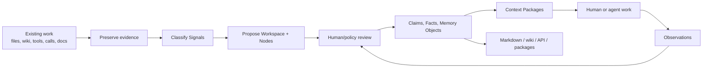

# First Workspace Story

Most people do not need another empty productivity app. They already have a
messy operating system spread across files, chats, calls, docs, calendars,
project tools, CRMs, and agent conversations.

Optimal Engine starts by accepting that reality.

The first workflow is:

```text
Bring what already exists
  -> preserve it as evidence
  -> classify the Signals
  -> propose Workspaces and Nodes
  -> ask about ambiguity
  -> review before durable truth
  -> render markdown/wiki/API/app views
  -> keep learning from work
```

## The Story

A user arrives with scattered context:

```text
markdown files
company wiki
calendar events
meeting transcripts
project tasks
CRM notes
proposal folders
contracts
SOPs
client requirements documents
agent chats
local scripts
MCP tools
custom APIs
```

Traditional systems usually do one of four things:

```text
store pages
search documents
run agent tasks
show dashboards
```

Optimal Engine connects those into one governed loop:



The system is self-learning because work feeds back into memory. It does not
mean the agent invents truth. It means every useful observation can re-enter the
governed lifecycle:

```text
work happens
  -> observation
  -> pending Claim
  -> review/policy
  -> Fact or Memory Object
  -> context refresh
  -> workflow trace
  -> reusable Skill Package when validated
```

## What The User Does First

The user can start in three ways.

### 1. Data Dump

Use this when the user has messy context and wants the engine to propose
structure.

```bash
mix optimal.initiate my-workspace --name "My Workspace" --dump setup.md
```

The dump can describe:

```text
what the company does
who the people are
which projects matter
where the wiki lives
which tools are connected
what documents are sent externally
what rhythm or review cadence exists
what packages are commonly created
```

### 2. Known Structure

Use this when the user already knows the starting Nodes.

```bash
mix optimal.setup my-workspace \
  --node project:launch:"Launch" \
  --node person:client-lead:"Client Lead" \
  --node operational:client-onboarding:"Client Onboarding"
```

### 3. Existing Wiki Or Folder

Use this when the user already has a company wiki, markdown vault, document
folder, or exported knowledge base.

```text
old wiki/folder/export
  -> import run
  -> Source Packages
  -> candidate Nodes
  -> pending Claims
  -> reviewed memory
  -> rebuilt projections
```

Use the starter prompt at:

```text
templates/starter-prompts/company-wiki-import.md
```

## What The Agent Does

The agent should not act like a magic organizer. It should follow the engine
rules:

```text
read or receive user context
  -> identify organization/workspace scope
  -> preserve raw input
  -> classify Signals
  -> propose Nodes, aliases, integrations, package types
  -> ask open questions
  -> run setup/initiation commands
  -> inspect output
  -> update projections
```

If it is not sure where something belongs, it routes to inbox/review instead of
polluting a durable Node.

## Communication Channels

People use different channels for different work. The setup should inventory
them.

| Channel | What it usually contains |
| --- | --- |
| Email | approvals, sent proposals, contracts, client follow-up |
| Calendar | meetings, recurrence, relationships, rhythm |
| Chat | decisions, handoffs, questions, files |
| Calls | transcripts, commitments, objections, requirements |
| Docs/wiki | reference, SOPs, strategy, project memory |
| CRM | relationships, deals, stages, requirements |
| Project tools | tasks, blockers, milestones, status |
| Code repos | implementation history, issues, releases |
| Scripts/API/MCP | actions agents can take |

Each channel becomes an integration surface. Each imported item becomes source
evidence before it becomes memory.

## Package Examples

Every organization sends things to people. Those things should be named in the
organization's language, then stored with the engine's lifecycle.

```text
Proposal
Contract
SOP document
Client requirements document
Handoff packet
Board report
Onboarding packet
Evidence packet
```

The engine stores:

```text
receiver
channel
stage
owning Node
source objects
required sections
review status
delivery artifact
audit record
```

That is why packages are not random folders. They are structured communication
bundles.

## Starter Prompts

Copy-paste starter prompts live here:

```text
templates/starter-prompts/
```

Use them with Codex, Claude Code, ChatGPT, MCP clients, or another agent that
can read the user's files.

The prompts are intentionally conservative. They tell the agent to preserve
evidence, propose structure, and ask before turning guesses into durable system
state.

