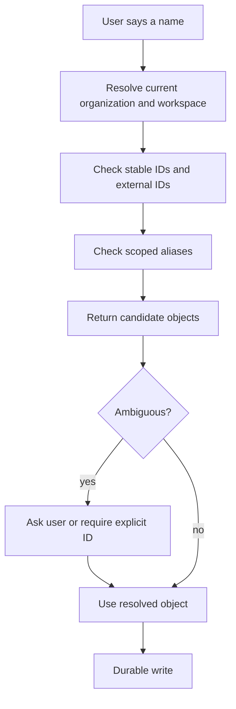

# Naming And Aliases

Optimal Engine has canonical internal terms, but users and organizations will
use their own language. The engine should preserve user language while mapping
it to stable objects.

The goal is not to force everyone to speak the same way. The goal is to prevent
names from becoming routing noise.

## Canonical Terms

Use these terms in engine internals and public docs:

| Canonical term | Meaning |
| --- | --- |
| Organization | Governance boundary for a person, team, company, tenant, or deployment. |
| Workspace | Bounded operating area inside an organization. |
| Node | Governed unit of context, purpose, relationships, state, and activity. |
| Node Type | The category of a Node, such as project, person, product, operational, context, learning. |
| Source Package | Preserved evidence before interpretation. |
| Signal | Classified interpretation of source material. |
| Claim | Unaccepted assertion extracted from a source or observation. |
| Fact | Reviewed or policy-accepted assertion. |
| Memory Object | Source-backed meaning around Facts, Claims, sources, and relationships. |
| Context Package | Authorized context bundle for a query or task. |
| Active Memory Pool | Task-scoped working memory. |
| Skill Package | Governed reusable procedure. |

## Projects Are Optional Nodes

A project is a Node with `node_type = project`, but not every workspace needs
Project Nodes. Project is the right type when the thing has bounded work:
scope, timeline, deliverables, milestones, blockers, and review cadence.

If the thing is ongoing, structural, or reference-oriented, use another Node
type:

| User language | Usually model as |
| --- | --- |
| Launch, implementation, migration, campaign | Project Node |
| Hiring, onboarding, publishing, finance review | Operational Node |
| Product, platform, service, offer | Product Node |
| Client, vendor, partner, account | Entity/Customer Node |
| Person, agent, stakeholder | Person Node |
| Research, knowledge base, market notes | Learning/Context Node |

Different users may call project-like things:

```text
project
initiative
engagement
campaign
deal
case
mission
program
account
workstream
client file
launch
```

The engine should not create different core object types for every label. It
should store the canonical type plus the user's label.

```text
node_type: project
display_label: Initiative
display_name: Q3 Partner Launch
aliases:
  - launch project
  - partner launch
  - q3 initiative
```

## Alias Storage

Every named object should separate stable identity from user-facing labels.

```text
stable_id
canonical_type
display_name
display_label
aliases
external_ids
slug
description
organization_id
workspace_id
metadata
```

Stable IDs are for machines. Display names and aliases are for people.

## Alias Scope

Aliases must be scoped.

```text
Organization alias
  -> usable across all workspaces in the organization

Workspace alias
  -> usable only inside one workspace

Node-local alias
  -> usable only inside one Node or active task scope
```

The same alias can exist in two different organizations. The same alias can
exist in two different workspaces if the current workspace is known. The same
alias should not point to two active Nodes in the same workspace unless the
engine always asks for confirmation.

## Naming Rules

| Rule | Why |
| --- | --- |
| Stable IDs do not change. | Links, audit, memory, and exports must survive renames. |
| Display names can change. | Human language changes over time. |
| Aliases are scoped. | "Launch" can mean different things in different workspaces. |
| Canonical type stays stable. | An "initiative" can still be a Project Node internally. |
| Loose names resolve to candidates first. | Agents should not guess on durable writes. |
| Ambiguity creates a question. | Asking once is cheaper than corrupting context. |
| External IDs are stored separately. | A CRM account ID, calendar ID, ticket ID, and Node ID are not the same thing. |

## Terms That Must Not Be Mixed

| Do not mix | Correct distinction |
| --- | --- |
| Organization vs Workspace | Organization owns governance. Workspace owns an operating context inside it. |
| Workspace vs Project | Project is usually a Node inside a Workspace. |
| Node vs Folder | Node is governed topology. Folder is a projection. |
| Source Package vs Signal | Source is preserved evidence. Signal is classification/interpretation. |
| Claim vs Fact | Claim is unaccepted. Fact is reviewed or policy-accepted. |
| Memory Object vs Context Package | Memory is durable meaning. Context Package is task/query packaging. |
| Genre vs Format | Genre is the expected kind of communication. Format is the container. |
| Format vs Structure | Format carries content. Structure is the internal skeleton. |
| Active Memory Pool vs Workspace | Pool is temporary task working state. Workspace is durable topology. |
| Skill Package vs Prompt | Skill is governed procedure with policy, inputs, checks, tools, and audit. |

## Signal Naming

When the engine classifies incoming material, it should keep five dimensions
separate:

```text
Mode      -> text, image, audio, video, code, table, event, mixed
Genre     -> meeting notes, decision, SOP, report, proposal, incident, research
Type      -> direct, inform, commit, decide, express
Format    -> markdown, PDF, email, JSON, calendar event, transcript, image
Structure -> agenda, ADR, spec, status update, postmortem, checklist, brief
```

These dimensions should not collapse into one label. A markdown file can contain
a decision, a report, meeting notes, or an SOP. A calendar event can be a
source, a signal, or evidence for a Fact depending on what it says and how it is
used.

## Resolution Flow



## Example

Two workspaces can use the same word differently:

```text
Workspace: Company OS
  "Launch" -> Project Node: Platform Launch

Workspace: Content OS
  "Launch" -> Campaign Node: Product Announcement Campaign
```

If the current workspace is `Company OS`, "launch" resolves to the Project
Node. If the current workspace is unknown, the engine should ask which workspace
or object the user means.

## Agent Rule

Agents can translate user language into canonical objects, but they should keep
the original words as aliases and source evidence.

Good:

```text
User says "client file."
Agent proposes Node Type: project or account.
Engine stores "client file" as alias/display label.
Human confirms.
Future routing uses stable Node ID.
```

Bad:

```text
User says "client file."
Agent silently creates a new top-level workspace.
Future sources route by fuzzy text only.
```

The first path preserves the user's language and keeps the system clean. The
second path creates noise.
