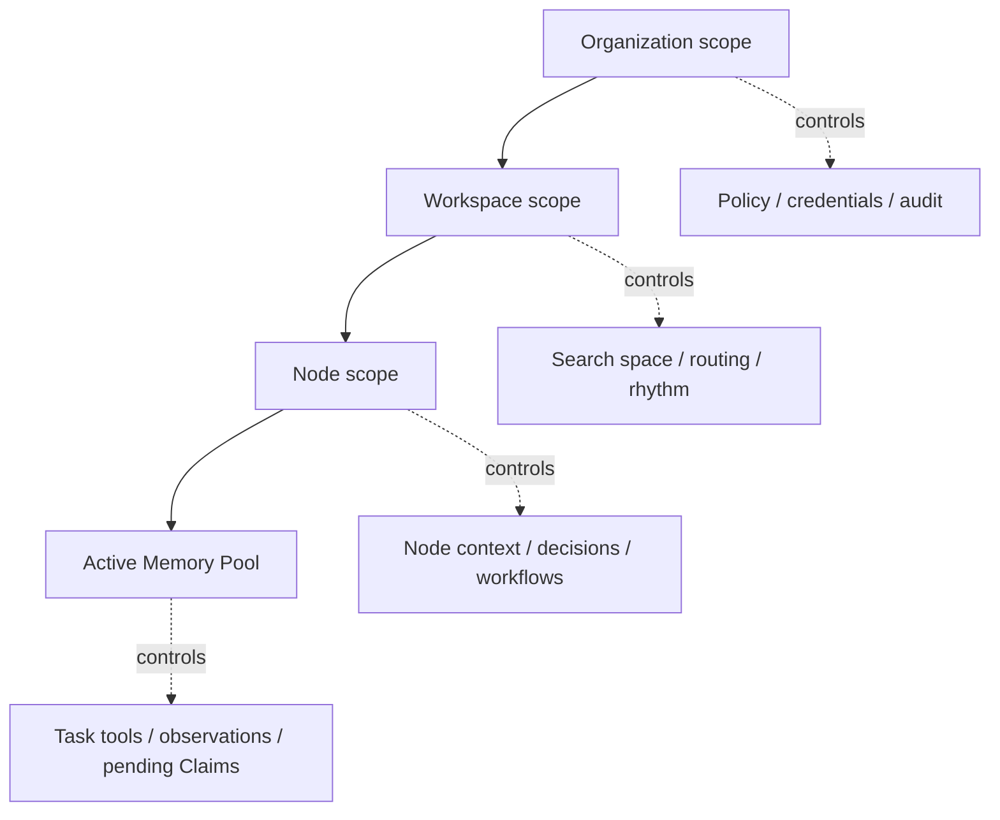

# Scope Switching

Optimal Engine needs clear scope rules so humans, agents, apps, and connectors
know what they are allowed to see and change.

The hierarchy is:

```text
Organization
  -> Workspace
      -> Node
          -> Active Memory Pool
```

Each level narrows the operating context.

## Scope Levels

| Scope | What it means | Switch when |
| --- | --- | --- |
| Organization | Governance, ownership, policy, membership, billing/deployment, and data boundary. | The legal owner, account, security boundary, or permission model changes. |
| Workspace | Bounded operating area inside an organization. | The operating context, node graph, rhythm, routing rules, or retrieval boundary changes. |
| Node | Specific unit of context, purpose, relationships, state, and activity. | The focus moves to a project, person, product, process, customer, research area, or other bounded unit. |
| Active Memory Pool | Temporary task context for human/agent work. | A bounded task starts and needs loaded context, tools, observations, and audit. |

Projects are usually Nodes, not Workspaces. A project becomes a Workspace only
when it needs its own long-lived node graph, members, policies, rhythm, and
retrieval boundary.

## What Switching Changes

Switching scope changes more than display.

| Switch | Affects |
| --- | --- |
| Organization | Available workspaces, identity, policy defaults, credentials, tenants, audit boundary, billing/deployment boundary. |
| Workspace | Visible Nodes, routing rules, rhythm files, default Node Types, source partitions, wiki/export tree, retrieval search space. |
| Node | Current context, linked sources, memory objects, decisions, workflows, permissions, status, blockers, local exports. |
| Active Memory Pool | Loaded Context Packages, task tools, model/tool grants, current observations, pending Claims, task audit. |

## Switching Diagram



## Practical Rules

### Switch Organization

Switch organization when the answer to one of these changes:

```text
Who owns this data?
Which policies apply?
Which credentials are allowed?
Who can audit it?
Which workspaces should even be visible?
```

Examples:

- moving from one company to another;
- switching from personal life to client work with different permissions;
- operating a separate tenant or deployment;
- using a connector credential that belongs to a different owner.

### Switch Workspace

Switch workspace when the operating world changes, but the same organization
still owns the data.

Examples:

- moving from `company-os` to `research-os`;
- separating internal operations from customer delivery;
- separating personal planning from product development;
- running a dedicated incident workspace for a major response.

### Switch Node

Switch Node when the topic changes inside the same workspace.

Examples:

- from a product Node to a project Node;
- from a project Node to a person Node;
- from a customer Node to an operational process Node;
- from a research Node to a decision Node.

### Open Active Memory Pool

Open a pool when work starts.

Examples:

- "prepare me for tomorrow";
- "refactor this subsystem";
- "review this customer account";
- "build the weekly report";
- "triage these support tickets".

A pool is not permanent topology. It is task-local working memory with loaded
context, humans, agents, tools, observations, pending Claims, and audit.

## Command Shape

Every CLI/API/MCP call should resolve scope before doing work:

```text
organization_id
workspace_id
node_id or node_alias
active_pool_id when task-scoped
actor_id
permission envelope
```

If the user provides a loose name, the engine should resolve it in the current
scope. If multiple matches exist, the agent should ask for disambiguation rather
than guessing.

## Scope Resolution Order

Use this order:

```text
explicit ID
  -> current session scope
  -> workspace-local alias
  -> organization-local alias
  -> fuzzy match with confirmation
  -> ask the user
```

Never route durable writes from fuzzy match alone. Fuzzy matches can produce
candidate suggestions, not silent topology or memory changes.

## Example

User says:

```text
Add the pricing call notes to the launch project.
```

Resolution:

```text
current organization
  -> current workspace
  -> resolve "launch project" alias
  -> confirm Node if ambiguous
  -> preserve notes as Source Package
  -> classify Signal
  -> attach pending Claims to the resolved Project Node
```

If two Nodes have the alias `launch project`, the engine must ask:

```text
Do you mean Project: Platform Launch or Project: Partner Launch?
```

That question is not friction. It prevents noise.
