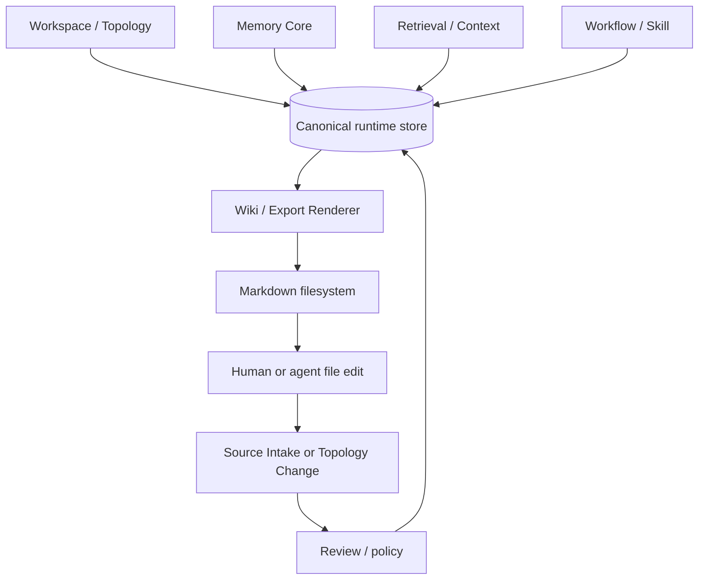

# Workspace Filesystem

Optimal Engine can project a workspace into markdown and folders so humans and
agents can inspect and edit the operating system directly.

The filesystem is a projection and editing surface. The database remains the
canonical runtime state for identities, permissions, provenance, memory,
retrieval packages, active pools, workflows, tool calls, and audit.

## Mental Model

```text
Database state -> filesystem projection
Filesystem edit -> Source Package or topology change -> reviewed database state
```

A folder can represent a Node, but the folder is not the Node. The Node is the
governed topology object with stable ID, type, relationships, lifecycle, policy,
and attached memory.

## Recommended Shape

One organization can have many workspaces. Each workspace can have many Nodes.

```text
optimal-workspace-root/
  organizations/
    example-company/
      organization.yaml
      workspaces/
        company-os/
          workspace.yaml
          AGENTS.md
          rhythm/
            daily.md
            weekly.md
            monthly.md
          nodes/
            project-platform-launch/
              node.yaml
              context.md
              signal.md
              sources/
              decisions/
              workflows/
              packages/
              exports/
            person-operations-lead/
              node.yaml
              context.md
              signal.md
            operational-client-onboarding/
              node.yaml
              context.md
              signal.md
        research-os/
          workspace.yaml
          AGENTS.md
          rhythm/
          nodes/
```

The exact folder names can vary. The stable IDs inside `organization.yaml`,
`workspace.yaml`, and `node.yaml` are what matter.

## What Each Part Means

| Path | Meaning | Canonical owner |
| --- | --- | --- |
| `organization.yaml` | Organization identity, policies, members, billing/deployment scope, default permissions. | Workspace / Topology |
| `workspaces/` | Bounded operating areas inside the organization. | Workspace / Topology |
| `workspace.yaml` | Workspace ID, display name, default node types, routing hints, export settings, active policies. | Workspace / Topology |
| `AGENTS.md` | Workspace-specific operating instructions for agents. | Export projection of governance and SOP state |
| `rhythm/` | Daily/weekly/monthly operating cadence, review loops, focus, stale context checks. | Active work / Workflow / Export |
| `nodes/` | Human-readable Node projections. | Workspace / Topology projection |
| `node.yaml` | Stable Node ID, type, aliases, owner, lifecycle state, parent, policy, external refs. | Workspace / Topology |
| `context.md` | Slow-changing Node context and source-linked memory summary. | Wiki / Export projection |
| `signal.md` | Current state, priorities, blockers, recent changes, open decisions. | Signal / Active work projection |
| `sources/` | Source links, imported files, source references, or local evidence awaiting ingestion. | Source Intake |
| `decisions/` | Decision projections backed by Claims, Facts, and Memory Objects. | Memory Core / Export |
| `workflows/` | Workflow and Skill Package projections for this Node. | Workflow / Skill Runtime |
| `packages/` | Receiver/channel bundles for this Node, often zipped or assembled from multiple files. | Wiki / Export |
| `exports/` | Generated views, HTML, reports, app-ready files, and loose output artifacts for this Node. | Wiki / Export |

## Packages

A package is a deliverable bundle for a receiver or channel. It is not the same
as a Skill Package.

```text
Package
  -> files bundled for a person, team, customer, channel, API, or external system

Skill Package
  -> governed reusable procedure that tells a human or agent how to do work
```

Node-specific packages belong inside the owning Node:

```text
nodes/project-platform-launch/packages/partner-update/
  package.yaml
  README.md
  launch-brief.md
  pricing-summary.pdf
  assets/
  dist/
    partner-update.zip
```

Cross-node packages may exist at workspace scope only when they intentionally
span multiple Nodes and carry a manifest listing their source Nodes.

```text
workspace-packages/q3-board-review/
  package.yaml
  README.md
  dist/
    q3-board-review.zip
```

If the package is about one project, customer, person, product, or operation,
put it under that Node. Do not put it at the workspace root.

## Projection Diagram



## Organization, Workspace, Node

Use the hierarchy strictly:

```text
Organization
  -> Workspace
      -> Node
```

An organization is the governance boundary. A workspace is an operating area
inside that boundary. A Node is a unit of context and activity inside a
workspace.

Projects are Nodes:

```text
Workspace: Company OS
  -> Project Node: Platform Launch
  -> Person Node: Operations Lead
  -> Product Node: Customer Portal
  -> Operational Node: Client Onboarding
```

Do not create a new workspace just because there is a project. Create a new
workspace when the operating context, policy, membership, or retrieval boundary
needs to be separate.

## Edit Rules

| User action | Engine interpretation |
| --- | --- |
| Edit `context.md` | New source evidence or proposed memory/context update. |
| Edit `signal.md` | New state observation or proposed focus/status update. |
| Edit `node.yaml` | Proposed topology change unless the actor has direct topology permission. |
| Add file to `sources/` | Source Package candidate. |
| Add file to `decisions/` | Decision Claim candidate, not automatically a Fact. |
| Add file to `workflows/` | Workflow/Skill candidate, not automatically approved procedure. |
| Add file to `packages/` | Package source or manifest for a receiver/channel bundle. |

The engine should preserve the edit, classify it, and then decide whether it is
a source, topology change, observation, Claim, Fact promotion candidate, workflow
candidate, or export-only artifact.

## Minimum First Workspace

A minimal workspace can start like this:

```text
my-org/
  organization.yaml
  workspaces/
    personal-os/
      workspace.yaml
      AGENTS.md
      rhythm/
        daily.md
        weekly.md
      nodes/
        project-first-launch/
          node.yaml
          context.md
          signal.md
          packages/
        person-me/
          node.yaml
          context.md
          signal.md
```

That is enough for:

- a human to inspect the structure;
- an agent to load operating instructions;
- intake to route new sources;
- retrieval to scope context;
- export to render wiki/app/API views.

## What Not To Do

Do not make:

- one giant workspace for unrelated organizations;
- a new organization for every project;
- folders without stable Node IDs;
- aliases that mean different things in the same workspace;
- markdown files that silently overwrite Facts;
- agent-written procedures that become Skills without review.

The filesystem should make the system understandable. It should not become an
unguarded second database.
